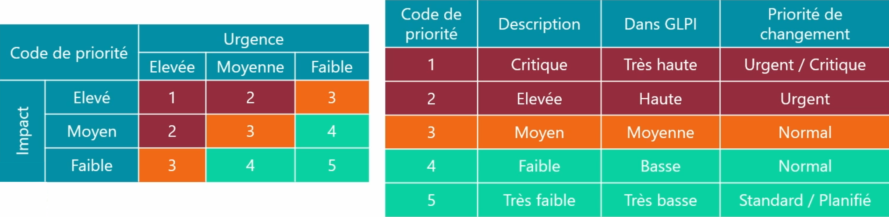

# Process Changement

### **🎯 Objectifs du processus :**

- S'assurer que les **méthodes et procédures** de traitement des changements sont **efficaces et efficientes**.
- Veiller à ce que **tous les changements** sur les **CI (Configuration Items)** soient : **Formellement enregistrés** dans le **CMS (Système de Gestion de Configuration)**.
- Répondre aux **demandes d’évolution** des services existants.

### **📌 Définition d’un changement :**

Toute **modification, ajout ou suppression** : d’un ou plusieurs **CI** (éléments de configuration), ou de **services** dans le **système d'information**.

## **🔍 Méthode "7R"**

Méthode d’analyse avant validation d’un changement :

| **Élément** | **Question posée** |
|----|----|
| **Reason** | Quelle est la **raison** du changement ? |
| **Return** | Quel est le **résultat attendu** ? |
| **Risk** | Quels sont les **risques potentiels** ? |
| **Resource** | Quelles sont les **ressources nécessaires** ? |
| **Responsible** | Qui est **responsable** du changement ? |
| **Relation** | Y a-t-il des **interférences** avec d’autres changements ? |

### **📥 Origines possibles d’un changement :**

- Mise à jour **légale ou réglementaire**.
- **Nouveaux actifs** ou composants.
- **Nouvelle organisation** ou **nouveaux standards**.
- **Évolution** ou **amélioration continue** de services existants.
- Intégration de **nouveaux fournisseurs** ou modèles de **sourcing**.
- Introduction de **nouvelles technologies**.

### **📤 Qui peut initier un changement ?**

- Tous les **clients** ou **utilisateurs**, y compris leurs **responsables**.
- Chaque demande passe par une **RFC (Request For Change)**.
- Toutes les RFC ne seront **pas forcément acceptées**.

### **🧾 Contenu obligatoire d’une RFC :**

- **Identifiant unique
- Date** de la demande
- **Nom du demandeur
- Priorité proposée
- Description détaillée du changement
- Analyse des risques
- Date souhaitée** de mise en œuvre
- **Estimation des ressources nécessaires** : Matériel, Humain, Temps

### **🗂️ Priorisation des changements :**

📌 L’objectif est de **gérer l’ordre de traitement** des changements selon :

- Leur **impact** sur l'infrastructure.
- Leur **urgence**.
- La **disponibilité des ressources**.

