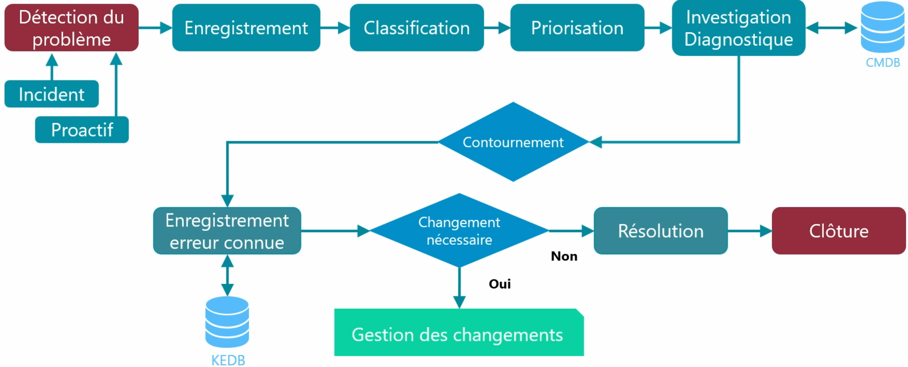

# **🔧 La gestion des problèmes**

La **gestion des problèmes** est un processus clé dans l’ITIL (et dans tout bon service informatique).

Son objectif est simple mais essentiel : 👉 **Identifier la cause profonde** des incidents récurrents pour éviter qu’ils ne se reproduisent. 👉 **Proposer une solution définitive** (ou un contournement efficace en attendant).

## **📌 Quelle différence avec la gestion des incidents ?**

Il ne faut pas confondre les deux !

| **Gestion des incidents** | **Gestion des problèmes** |
|----|----|
| Vise à **rétablir rapidement** un service. | Vise à **identifier la cause** d’un ou plusieurs incidents. |
| Réagit à un incident ponctuel. | S’attaque à des **incidents récurrents ou complexes**. |
| Travaille souvent dans l’urgence. | Travaille avec plus de recul, pour apporter une solution pérenne. |
| Gérée par les techniciens **niveau 1**. | Gérée par les techniciens **niveau 2 ou 3**. |

## **❓ Qu’est-ce qu’un « problème » dans ce contexte ?**

Un **problème**, c’est : Une **situation non résolue**, liée à **un ou plusieurs incidents récurrents**, pour laquelle on **ne connaît pas encore la cause**.

📌 Exemple : Un serveur plante tous les lundis matin. Les incidents sont résolus chaque fois (redémarrage), mais **on ne sait pas pourquoi** cela arrive => ça devient un problème à analyser.

## **🧩 Notion clé : l’erreur connue**

Une **erreur connue** est un **problème dont la cause est identifiée**, même si une solution définitive n’est pas encore déployée.

✅ Elle est stockée dans la **base de connaissances (Known Error Database - KEDB)** pour permettre aux techniciens de niveau 1 de : reconnaître rapidement le problème, appliquer un contournement efficace, informer l’utilisateur clairement.

## **🎯 Objectif global**

L’objectif de la gestion des problèmes est double : **Réduire le nombre et l’impact des incidents** à long terme et **Améliorer l’efficacité des équipes de support** grâce à une documentation centralisée et à jour.

