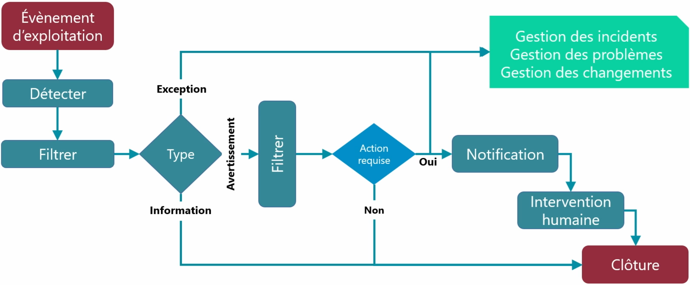

# Gestion des événements

La **gestion des événements**, c’est l’art **d’anticiper les incidents** avant qu’ils ne se produisent. 
- 👉 Elle vise à **réduire le nombre d’incidents** en surveillant en permanence l’infrastructure informatique. 

Un **événement**, c’est tout simplement **un fait détecté automatiquement** par un outil de supervision ou dans un journal système, qui signale **un changement d’état** ou une activité particulière sur un composant du SI (serveur, application, service, base de données, etc.).

### **⚠️ Tous les événements ≠ incidents**

Heureusement, **tous les événements ne mènent pas à des incidents** ! 👉 L’idée est justement de **filtrer, analyser et classer** les événements pour réagir **avant qu’un service ne tombe**.

## **🧾 Définition d’un événement**

Un **événement** est un **fait détectable, mesurable et observable** dans un système d'information pendant la fourniture d’un service.

🔍 Il peut correspondre à : un changement d’état (ex. : un serveur passe en surcharge), une alerte système (ex. : disque à 90%), ou une simple notification (ex. : tâche planifiée exécutée avec succès). 📌 Important : **Si ce n’est pas observable ni mesurable, alors ce n’est pas un événement ITIL.**

### **🔍 Outils utilisés pour détecter les événements**

- **Journaux d’événements (logs)** : système, sécurité, applications...
- **Logiciels de supervision** comme : Nagios / Centreon, Zabbix, PRTG, GLPI avec plugin monitoring

### **🧩 Les 4 types d’événements**

| ✅ **Normal** | Tout fonctionne comme prévu. Exemple : "Sauvegarde terminée avec succès." Pas besoin d’action. |
|----|----|
| ⚠️ **Avertissement** | Signale une **situation inhabituelle**, sans impact immédiat. Exemple : "Disque à 85%" → nécessite une **surveillance** ou une action préventive. |
| ❌ **Exception** | Quelque chose ne s’est **pas passé comme prévu**. Peut être visible par l’utilisateur, mais sans interruption critique. Peut évoluer en incident. |
| 🚨 **Alerte** | Situation **critique**. Intervention immédiate requise. Exemple : "Serveur HS", "Process arrêté" → un technicien doit agir **rapidement**. |

## **🧠 Comment ça fonctionne ? Le cycle d’un événement**

- **Détection** : via les outils de supervision ou les logs.
- **Filtrage** : on écarte les événements sans importance.
- **Classification** : Événement **normal** → enregistré, puis clôturé.
- **Avertissement** → surveillance, alerte éventuelle.
- **Exception** ou **alerte** → envoi de notification, action requise.

Si l’événement évolue : en **incident**, il est pris en charge par la **gestion des incidents** :
- s’il est **récurrent** et complexe → escalade vers la **gestion des problèmes**.
- s’il nécessite des modifications → déclenchement de la **gestion des changements**.

