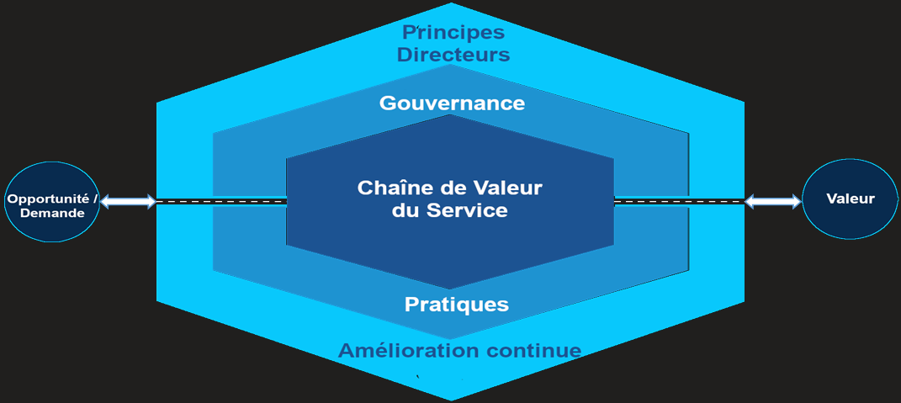

# Système de Valeur - Services

#### **🟢 DEMANDE**

Tout commence par une **demande** ou une **opportunité**. Un **client** ou un **sponsor** a un besoin : → il fait une **demande de service**. On garde "opportunité" en tête pour plus tard (ex. : proposer un nouveau service sans demande explicite).

#### **🎯 VALEUR (résultat final)**

Le but final = produire de la **valeur** pour l’utilisateur. Valeur = **efficacité**, **gain de temps**, **sécurité**, **fiabilité**, etc. **Attention** : Si l’utilisateur ne **ressent pas** la valeur → le service **échoue** à remplir sa mission.

#### **🔗 CHAÎNE DE VALEUR DES SERVICES (au centre du SVS)**

C’est là que **toute la magie opère** : on y décrit toutes les étapes pour **concevoir**, **produire** et **livrer** un service. Elle sera **détaillée dans un module à part**, mais retiens que c’est le **moteur** du système.

#### **↩️ Boucle continue**

Une fois la valeur livrée : Elle peut **générer de nouvelles demandes** (besoin d’un service complémentaire, d’une amélioration, etc.) D’où la présence d’**"opportunité"** à côté de "demande"

#### **⚙️ PRATIQUES**

C’est ce qu’on appelait **"processus" dans ITIL v3 / 2011 >** Représente les **ressources organisationnelles** (moyens, méthodes, compétences) pour **réaliser le travail.** Ex. : gestion des incidents, gestion des changements, etc. On en verra **34 en tout**, classées en 3 grandes familles.

#### **🧭 GOUVERNANCE**

Permet à l’organisation d’avoir : Une **direction claire,** Un **contrôle** efficace sur les actions → C’est le **cadre de pilotage** : prise de décision, règles, priorités…

#### **📈 AMÉLIORATION CONTINUE**

C’est une **activité transverse** : présente à **toutes les étapes**. Objectif : toujours **apprendre de l’expérience**, ajuster, corriger, progresser. 🧠 Esprit DevOps / Lean : on **itère**, on ajuste, on s’améliore constamment.

#### **💡 PRINCIPES DIRECTEURS**

7 recommandations générales pour aider à : **Garder le cap**, même si la stratégie de l’entreprise évolue, **Réagir intelligemment** au changement et S’organiser de manière **souple et efficace**

