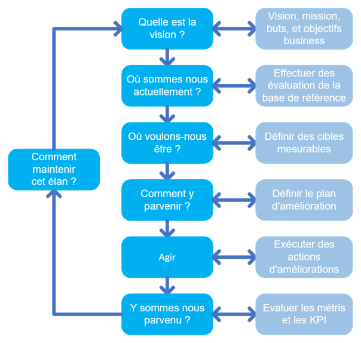
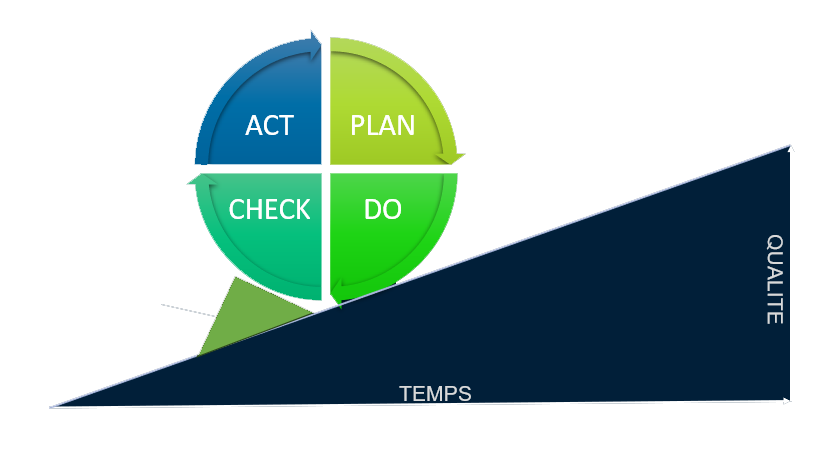

# Améliorer

**🎯 Objectif :**

Assurer **l’amélioration continue** de **tous les produits, services, processus, pratiques**… bref, tout ce qui touche à la chaîne de valeur et aux 4 dimensions de la gestion des services.

L’idée, c’est de ne jamais stagner, toujours chercher à faire mieux, que ce soit en efficacité, qualité, coûts ou satisfaction.

## **🔗 Connexion avec la chaîne de valeur :**

Cette activité **intègre la notion d’amélioration continue** dans toutes les autres activités, en s’appuyant sur les retours du terrain, les données de performance et les nouvelles idées.

C’est le moteur qui pousse à évoluer constamment.

### **🧰 On utilise pour ça :**

- 📊 Les données de **performance** (monitoring, SLA, temps de résolution, etc.)
- 📢 Les **retours des utilisateurs** et parties prenantes (feedback, plaintes, suggestions)
- 📚 Les informations sur les composants de service, produits, processus

### **📦 Ce que ça produit :**

- 🔄 Des **plans d’amélioration** stratégiques et opérationnels
- ✅ Des **changements dans le portefeuille de services** (arrêter ce qui ne marche pas, améliorer ce qui est utile)
- 🛠️ Des **modifications dans les architectures, politiques, processus** pour gagner en efficacité
- 🔍 Des **opportunités d’amélioration** pour les autres activités (ex : nouvelles fonctionnalités à concevoir, besoins de formation, etc.)

## **🧪 Exemple avec notre projet ITSM GLPI :**

- Analyse régulière des tickets et incidents pour identifier les points bloquants
- Collecte des retours utilisateurs sur l’ergonomie et les fonctionnalités de GLPI
- Mise en place d’indicateurs pour mesurer la satisfaction et les performances du service
- Propositions d’évolutions (ex: ajout d’un module ou automatisation) à intégrer dans la roadmap
- Mise à jour des procédures et documents selon les retours et le contexte évolutif

- PLAN : Etablir les objectifs et processus nécessaire à la production de valeur en accord avec l’objectif

- DO : Effectuer les actions, créer le produit ou le service

- CHECK : Analyser les retours, les métriques et rechercher les différences éventuelles avec l’objectif

- ACT : Demander des correctifs pour les différences importantes, analyser les différences afin de trouver la cause originelle de cette différence (root cause)

