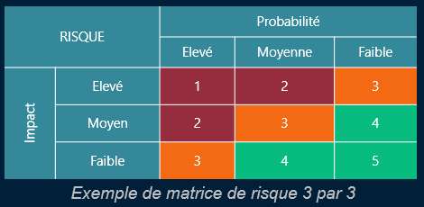

# Habilitation de changement

L’**habilitation des changements** (ou *Change Enablement*) définit comment un changement est : Analysé, Validé, Planifié avant sa mise en œuvre.

👉 Chaque orga décide **de son périmètre**, mais l’objectif reste **le même** : ⚖️ Trouver le bon **compromis entre bénéfices et risques**.

## **🔁 Qu’est-ce qu’un changement ?**

Toute **modification** impactant **le système d’information** : 
- Ajout / suppression de matériel ou logiciel,
- Reconfiguration de serveurs et Modification d’un processus métier numérique
  
⚠️ Ne pas confondre : ✅ **Request for Change (RFC)** : demande de changement et ❌ **Request for Comment (RFC)** : standardisation de protocoles (IETF)

### **🔩 Quelques termes clés à connaître**

| **CI (Configuration Item)** | Composant identifié du SI (serveur, appli, routeur, etc.) |
|--|--|
| **CMS (Config. Management System)** | Outil qui gère les CI et leurs relations |
| **RFC (Request For Change)** | Demande formelle de changement |
| **CAB (Change Advisory Board)** | Comité qui valide les changements *normaux* |
| **eCAB (Emergency CAB)** | Comité spécial pour les changements *urgents* |
| **Calendrier des changements** | Planning officiel pour ne pas provoquer d’incidents par chevauchement |

## **🧠 Classification des changements**

| **Type** | **Description** | **Évaluation** | **Autorisation** |
|--|--|--|--|
| 🔵 **Standard** | Répétitif, documenté, faible risque | Aucun CAB | Pré-approuvé |
| 🟠 **Normal** | Demande une analyse, parfois complexe | Oui (CAB) | Après validation |
| 🔴 **Urgent** | A mettre en place immédiatement | eCAB si possib. | Accélérée, procédure simplifiée |

### **🟢 Changement Standard**

- 💡 Déjà connu, documenté, testé 📉 Risque faible, bien maîtrisé
- 📄 Déclenché via un **formulaire prédéfini** 🔐 Pré-approuvé → **Pas besoin du CAB**
- 🛠️ Exemples : Installation d’un poste de travail, Ajout d’un utilisateur AD,

### **🟠 Changement Normal**

- ⚙️ Nécessite une **évaluation** des impacts, Peut avoir des risques, un effort conséquent
- Validation par le **CAB** après étude 🔁 Planifié dans le calendrier

🧪 Exemple : Ajout d’une baie Dell EMC avec 200 To dans un datacenter

### **🔴 Changement Urgent**

- 🚨 Concerne une **faille de sécurité**, une **panne critique**, ou un **incident majeur**
- Demande **rapide**, validée par le **eCAB** ❗ Prévoir un **plan de retour arrière (rollback)**
- Moins de tests, moins de doc au départ → rattrapage **après** mise en œuvre

🧪 Exemple : Correction immédiate de la faille **Log4Shell (CVE-2021-44228)**

## **📦 Importance de la gestion des CI**

🎯 On ne peut pas évaluer un changement si on ne sait pas : Quels composants sont impactés, Où ils sont, Qui les utilise, Comment ils sont liés ➡️ Importance du **CMS**

### **🛡️ Gestion du risque**

🎯 But : **Anticiper et gérer** ce qui pourrait mal se passer

### **📊 Calcul du risque**

Risque = **Impact × Probabilité**

On le classe via une **matrice** :

Impact : Faible / Moyen / Fort

Probabilité : Improbable / Probable / Très probable

Résultat : 🟩 Vert / 🟧 Orange / 🟥 Rouge

🧠 Chaque entreprise peut affiner avec plus de niveaux (4x4, 5x5, etc.)

