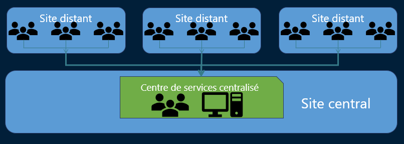

# Centralisé

### **⚙️ Définition :**

Un **centre de services centralisé** est un **point unique**, souvent **externalisé** ou situé dans un **siège social**, qui traite les tickets de **plusieurs sites distants**.

### **🧠 Caractéristiques clés :**

| **Élément** | **Détail** |
|--|--|
| 📍 Implantation | Un **site unique**, parfois externalisé ou en interne |
| 📞 Canaux de contact | Téléphone, e-mail, portail intranet, outils de ticketing |
| 📡 Destiné à | Plusieurs **sites distants** ou agences d’une même entreprise |

### **✅ Avantages :** 
- Mutualisation
- Centralise les ressources humaines, techniques et outils
- Procédures homogènes
- Tous les utilisateurs bénéficient des **mêmes niveaux de service**, des **mêmes process**
- Partage des connaissances
- Meilleure documentation, base de connaissance unifiée

### **❌ Inconvénients :** 
- Moins de proximité
- Pas de présence physique sur sites distants
- Réactivité réduite
- Dépend du réseau, outils à distance, délais de réponse

## **🔧 Contournement des inconvénients :**

| 🖥️ Outils de prise en main à distance | Aider les utilisateurs à distance (ex : Anydesk, TeamViewer, RDP…) |
|--|--|
| 👨‍🔧 Technicien de proximité | Un agent sur site pour les interventions physiques ponctuelles |
| 🧩 Mix centre local + centralisé | Certains sites peuvent garder **un mini support local** |

### **🧩 Remarque importante :**

Le **centre de services centralisé** peut **aussi servir de centre local** pour le **site principal** (siège), ce qui rend le modèle **hybride**.

