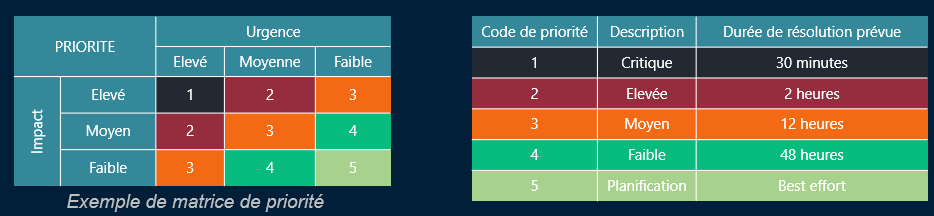

# Priorité / Escalade

Tous les incidents ne se traitent pas de la même manière. La priorité, c’est ce qui permet de hiérarchiser les interventions > Formule de base : 👉 Priorité = Impact × Urgence

### 🔧 **Impact ➜ C’est le “quoi”**

Tu évalues : Combien de personnes sont touchées ? 👥 / Est-ce que ça bloque un métier critique ? 🏭 / Y a-t-il un risque légal ou une perte financière ? ⚖️💰

💡 Exemples : Un seul utilisateur sans accès à sa boîte mail → **impact faible /** Le service compta bloqué en pleine clôture mensuelle → **impact élevé**

### ⏱️ **Urgence ➜ C’est le “quand”**

Tu regardes : Combien de temps on peut tenir sans ce service ? / Est-ce qu’il y a un SLA à respecter rapidement ? / Est-ce que le service peut contourner le problème temporairement ?

💡 Exemples : La panne bloque une opération immédiate ? → **urgence haute /** Le service est peu utilisé et la demande est planifiable ? → **urgence basse**

📜 **Ces niveaux doivent être définis dans les SLA** → Pour chaque service, on *négocie* ça **en amont avec le client**.

## 📈 **L'escalade des tickets**

Quand tu ne peux pas résoudre un ticket ➜ **tu l’escalades** 🆙 🎯 Objectif : **garantir que l’incident soit pris en charge par quelqu’un de compétent, sans le laisser traîner**

### 👨‍🔧 **Les différents niveaux de support**

| **Niveau 0** | Standard / Call Center. Saisie, tri, catégorisation, mais *pas de technique*. (Souvent couplé au N1) 📞 |
|--|--|
| **Niveau 1** | Technicien de support : résout les incidents simples, guide l’utilisateur, origine des investigations, 🧑‍💻 |
| **Niveau 2** | Administrateur ou expert d’un domaine : incidents techniques plus complexes 🧠 |
| **Niveau 3** | Architecte, ingénieur, constructeur (ex : Microsoft, Cisco…) ou expert produit ⚙️🧪 |

💬 En fonction de l’entreprise, **les rôles peuvent varier ou être fusionnés**. L’important c’est que le ticket **avance vers la bonne personne.**

### 📤 **Types d’escalades**

1.  ⚙️ **Escalade fonctionnelle** → *Quand tu n’as plus les compétences pour gérer le ticket*

    - Tu transfères vers un **niveau supérieur** Ou vers un **collègue d’un autre domaine** (ex : réseau → sécurité)

2.  🧨 **Escalade hiérarchique** → *Quand il faut alerter les chefs !*

    - *>* Incident critique, impact métier fort / Manque de ressources, de décisions, ou **besoin d’arbitrage /** Utilisée pour **débloquer une situation urgente**

