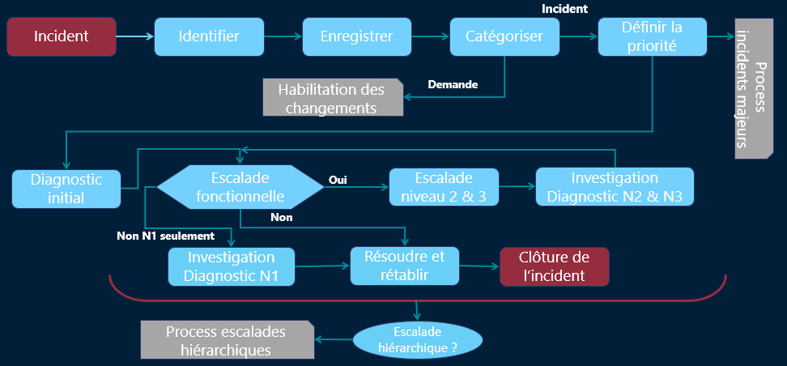

# Process / Incident Majeur

🧩 On parle ici **d’activités**, pas de rôles → peu importe que ce soit le N1 ou le N2, c’est *le flux logique* qui compte.

#### **1️⃣ Identification de l’appelant et de l’incident**
- 📞 Qui appelle ? Qui est concerné ?
- 👤 Ce n’est *pas toujours* la même personne → ex : une assistante signale un problème pour son chef.

#### **2️⃣ Enregistrement du ticket** 
- 📝 On trace *tout de suite* dans l’outil ITSM → date, heure, interlocuteur, description.
- ➡️ **Pas de ticket = pas de support.**

#### **3️⃣ Catégorisation du ticket** 
- 📂 On le range dans la bonne case : incident ? demande ? changement ?
- 🎯 S’il s’agit d’un **changement**, on redirige vers la **pratique Gestion des changements**.
- S’il s’agit d’une **demande**, idem vers **Gestion des demandes**.

#### **4️⃣ Définir la priorité (impact × urgence)** 
- 📊 C’est ici qu’on applique la **matrice de priorité**
- ➡️ C’est ce qui permettra **d’ordonner le traitement**.

#### **5️⃣ Détection d’un incident majeur ?** 
- 🔥 Si c’est un **incident majeur**, on **bascule dans la procédure de crise** (voir ci-dessous). Sinon on continue avec le **diagnostic initial**.

#### **6️⃣ Diagnostic initial (N1)** 
- 🔍 Le technicien commence les vérifs de base, pose des questions, fait des tests simples.

#### **7️⃣ Escalade vers N2 nécessaire ?** 
- 📈 Si besoin de compétences plus poussées ➜ **escalade vers N2 /** 
- 📨 Sinon, N1 continue ses investigations

#### **8️⃣ Action de correction** 
- 🛠️ Une fois le diagnostic posé, on applique une **solution temporaire ou définitive**.
- 📌 Le but ici : **rétablir le service**. Même si ce n’est pas parfait, on vise la reprise d’activité.

#### **9️⃣ Clôture du ticket** 
- ✅ Avant de fermer, on **confirme avec l’utilisateur** que c’est OK.
- Puis on clôture avec : Détails de la solution apportée, Temps de résolution, Satisfaction utilisateur (si demandé)

📍 **Escalade hiérarchique possible à tout moment** 🧨 Si : 
- Le ticket stagne
- Il y a des blocages
- L’impact est plus important que prévu
→ On **prévient les responsables** pour arbitrage ou mobilisation exceptionnelle.

## **🚨 Focus : L’incident Majeur**

C’est **le niveau supérieur de gravité**. Dès qu’il est détecté,

il **sort du circuit classique**.

### **📋 Caractéristiques**

- Fort **impact client** ou business
- Ne rentre **pas** dans les grilles standards de priorité
- Génère souvent un **fort stress organisationnel**
- Peut impliquer :
  - Perte de chiffre d’affaires 💸
  - Blocage de production 🏭
  - Risque réputationnel ou légal ⚖️

#### **🧯 Traitement en “mode crise”**

### 🔁 Un **processus spécifique** est lancé :

- 📣 Communication directe avec les parties prenantes
- 🧑‍💼Mobilisation référents métiers, admins, ingés.
- ⏱️ Suivi en temps réel (souvent par conférence téléphonique ou outil collaboratif live)
- 🗒️ Rapport d’incident généré à la fin (post-mortem)

