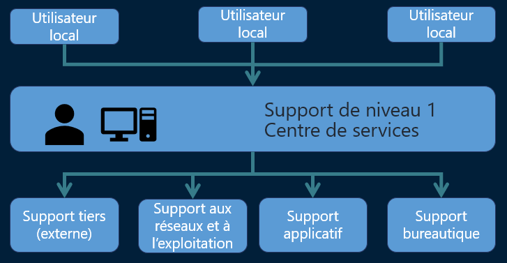

# local**🧍‍♂️ Utilisateurs locaux**

Ils sont en haut de la chaîne, ce sont les salariés / usagers du site, qui rencontrent un souci ou ont une demande :

**🎧 Support de niveau 1 / Centre de services (local)**

Situé **sur le site**, le centre de service **traite en direct** les demandes des utilisateurs :

- Point de contact unique (SPOC)
- Traitement des demandes simples (incidents, accès, bureautique…)
- Diagnostic de 1er niveau
- Escalade si besoin

**🔄 Escalade vers les soutiens techniques spécialisés :**

Le centre de service **collabore avec 4 blocs techniques** pour résoudre les cas plus complexes :

| 🛠️ Support tiers (externe) | Maintenance matérielle, éditeurs, prestataires |
|--|--|
| 🌐 Support aux réseaux et exploitation | Pannes réseau, serveurs, sauvegardes, supervision |
| 📦 Support applicatif | Bugs, lenteurs ou demandes sur les logiciels métier |
| 💻 Support bureautique | Problèmes liés à Word, Excel, imprimantes, PC, messagerie, etc. |

