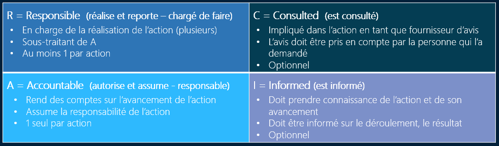
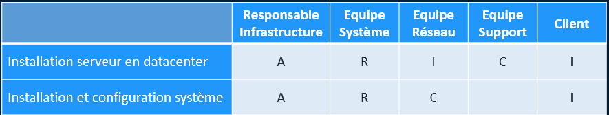

# 6 - BONUS**🧩 C’est quoi cette matrice ?**

La **matrice RACI** est un outil de **clarification des rôles et responsabilités** sur un processus, une tâche, une activité ou un projet.

L’idée, c’est d’éviter les situations du type :

- « Je croyais que c’était toi qui devais le faire… »
- « Ah, on m’a pas prévenu... »
- « Personne ne suit ce truc ! »

💡 Résultat : **plus de zones floues**, tout le monde sait **qui fait quoi** à chaque étape.

**⚙️ Utilisation concrète en ITIL**

Tu peux l’utiliser pour :

- Chaque **pratique ITIL** (ex : incident, problème, changement…)
- Définir **qui intervient à quel moment**
- Structurer des **plans d’escalade**
- Mettre de l’ordre dans les **procédures d’exploitation**

**🛡️ Pourquoi c’est important ?**

- **Évite les flous et doublons**
- Permet un **suivi rigoureux**
- Aide à la **montée en maturité** des processus

&nbsp;

- Facilite la **gouvernance IT**

**Exemple express** : Dans une **gestion d’incident**, on pourrait avoir :

| R – Responsable | Technicien de niveau 1         |
|-------|------------|
| A – Accountable | Manager support                |
| C – Consulted   | Responsable applicatif         |
| I – Informed    | Responsable métier utilisateur |

