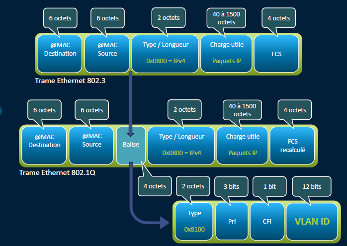
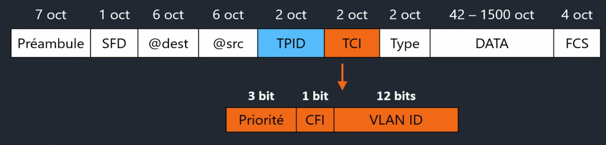

# Trame Ethernet

**📡 La trame Ethernet 802.3 – Vue générale**

La **trame Ethernet** est l’unité de base du transport de données sur un **réseau local filaire**. Elle contient **plusieurs champs** qui assurent la bonne livraison des données.

🎯 Comprendre sa structure = savoir lire un paquet dans Wireshark, déboguer un switch, ou analyser un souci réseau.

## **🧱 Champs clés d’une trame Ethernet classique**

Une trame **norme IEEE 802.3** est composée de :

1.  **📨 Destination MAC Address** : à qui sont destinées les données
2.  **📤 Source MAC Address** : qui a envoyé la trame
3.  **📘 Ethertype** : indique le protocole encapsulé (0800 = IPv4, 86DD = IPv6)
4.  **📦 Payload (ou Data)** : contenu utile (ex : paquet IP, ARP…)
5.  **✅ CRC Checksum** : contrôle d'intégrité (erreurs de transmission)

## **🏷️ Trame Ethernet avec tag VLAN (802.1Q)**

Quand une trame est **taguée VLAN**, des champs supplémentaires s'ajoutent **entre** l’adresse MAC source et l’Ethertype :

- **🔖 TPID (Tag Protocol ID)** : 0x8100 signale un tag VLAN
- **📊 TCI (Tag Control Info)** : contient 3 sous-champs :
  - **Priority (3 bits)** : gestion QoS (ex : VoIP en priorité)
  - **CFI (1 bit)** : obsolète (Token Ring only)
  - **VLAN ID (12 bits)** : identifie le VLAN (1 à 4094)

⚠️ Si tu vois une trame avec **8100** en Ethertype → VLAN tagué présent !

### **⚔️ Domaines de collision – À ne pas négliger**

Un **domaine de collision** = zone où deux paquets peuvent entrer en collision

**🧱 Hubs & répéteurs** : tout le monde dans le même domaine (⚠️ collisions possibles)

**🧠 Switches** : 1 domaine de collision par port → plus efficace, moins de collisions

🧠 **+ de domaines = + d’efficacité réseau** → d'où l’intérêt des switches en entreprise.

