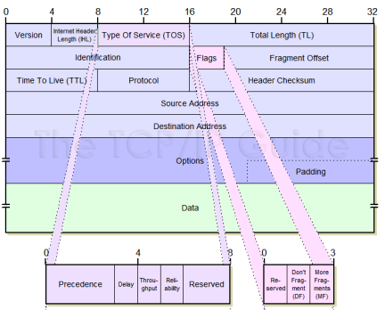

# Paquet IPv4> **🌐 Présentation du paquet IPv4**

Le **paquet IPv4** est l'unité de base pour le transport de données dans un réseau IP. Il agit comme un **conteneur intelligent**, qui transporte non seulement les données, mais aussi toutes les infos nécessaires pour **les livrer proprement** d’un point A à un point B, en respectant les règles réseau.

**🧱 Structure du paquet IPv4 – Champs principaux**

Voici les **champs clés** qui composent un paquet IPv4 :

1.  **📌 Version** : identifie IPv4 (valeur 4)
2.  **📏 Longueur d’en-tête (IHL)** : taille de l’en-tête en mots de 32 bits
3.  **🎯 Type de service (ToS)** : QoS/DSCP – priorité du paquet
4.  **🧱 Longueur totale** : taille complète du paquet (en-tête + données)
5.  **🧩 Identification** : identifie les fragments d’un même paquet
6.  **🚩 Indicateur (Flags)** : contrôle la fragmentation (DF, MF)
7.  **📐 Fragment Offset** : position du fragment dans le paquet original
8.  **⏳ Time to Live (TTL)** : nombre de sauts max avant suppression
9.  **📡 Protocole** : indique le protocole encapsulé (ex : 6 = TCP, 17 = UDP)
10. **🔍 Checksum de l’en-tête** : vérifie l’intégrité du header
11. **📬 Adresse source** : IP de l’expéditeur
12. **📥 Adresse de destination** : IP du destinataire
13. **⚙️ Options (facultatif)** : ajout de fonctionnalités spécifiques
14. **📶 Remplissage (padding)** : alignement sur 32 bits

🧠 À noter : seuls certains champs changent souvent (TTL, checksum, etc.), les autres restent assez stables en transit.

**🛠️ Rôle et utilité des champs**

Chaque champ a une **fonction bien définie** :

- Les **adresses IP** permettent le routage
- Le **TTL** évite les boucles réseau (si TTL = 0 → paquet supprimé)
- Le **fragment offset + identification** gèrent les paquets trop gros pour un lien
- Le **champ protocole** sert à indiquer le contenu (TCP, UDP, ICMP…)

