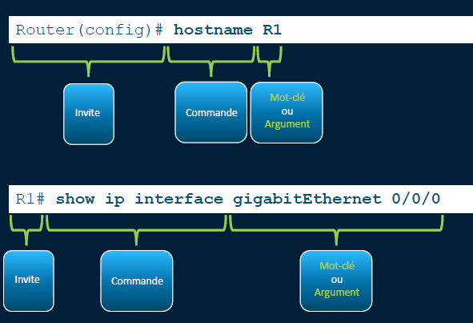
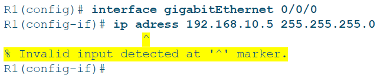
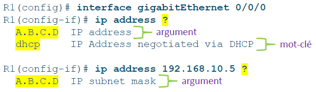

# Structure des commandes

## **🧱 Structure de base d’une commande IOS**

Une commande IOS est **composée de mots-clés + arguments** (valeurs variables).

Exemples :

- `show ip protocols` ➜ **show** = commande, **ip protocols** = arguments
- `ping 192.168.10.5` ➜ **ping** = commande, **192.168.10.5** = destination à tester

Chaque commande part toujours du **prompt** (ex : Switch# ou Router>).

## **❓🕵️ Aides disponibles dans IOS**

Deux outils très pratiques :

- **? (point d’interrogation)** ➜ propose les options possibles à l’endroit où il est placé  
  Ex : `ping ?` ➜ suggère ip, ipv6, etc.

- **^ (accent circonflexe)** ➜ **montre l’erreur dans une commande tapée  **
  Ex : `interface LastEthernet (mal écrit)` ➜ le ^ apparaîtra sous "L" pour signaler l'erreur

## **⚡ Raccourcis clavier indispensables**

IOS permet de gagner un max de temps avec des raccourcis :

- **Tab** ➜ autocomplète une commande
- **Backspace** ➜ supprime le caractère à gauche
- **← ou Ctrl+B** ➜ déplace le curseur vers la gauche
- **→ ou Ctrl+F** ➜ déplace le curseur vers la droite
- **↑ ou Ctrl+P** ➜ remonte dans l'historique des commandes

💡 Ces raccourcis marchent dans *tous les modes IOS* (utilisateur, privilégié, configuration...).

**🧃 À retenir**

- La syntaxe IOS est **rigoureuse** : bonne orthographe + bon ordre
- **Mots-clés + arguments**, séparés par des espaces
- Les aides `?` et ^ sont **tes meilleurs amis** pour éviter les erreurs
- Les **raccourcis clavier** boostent ta productivité au quotidien

