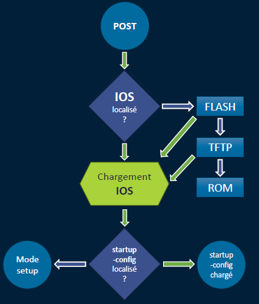

# Mémoires et enregistrement12:14

**🧠 Les différentes mémoires de l’IOS**

Chaque type de mémoire a un rôle bien précis au boot ⬇️

- **ROM** : contient 🪫 *bootstrap*, *POST*, *ROM Monitor*, *RxBoot (mini IOS)*
  - ➜ gestion du démarrage, tests matos
- **Flash** : contient l’**IOS** complet, donc indispensable au fonctionnement 🧬
- **NVRAM** : contient la **startup-config**, celle qui est lue au démarrage 🛫
- **RAM** : utilisée pendant l’exécution
  - contient la **running-config**, la table de routage, etc. Volatile 🧯

🧩 Le registre de configuration (*configuration register*) se trouve aussi en NVRAM

➜ il décide de *comment* l’équipement boot (ex : mode ROMmon si l’IOS est corrompu)

**🦾 Ordre de chargement au démarrage**

1️⃣ **ROM** (bootstrap / mini-IOS si nécessaire)

2️⃣ **Flash** (chargement de l’IOS)

3️⃣ **NVRAM** (lecture de la startup-config)

4️⃣ **RAM** (copie de la startup-config dans la running-config, exécution)

🎯 La running-config est donc toujours une copie volatile de la startup-config…

sauf si tu bosses dessus et que tu oublies de la sauvegarder 💣

**📂 Les fichiers de configuration**

Deux configs à bien distinguer :

- **Startup-config** 🪪 (NVRAM) ➜ config de démarrage, persistante
- **Running-config** ⚙️ (RAM) ➜ config active, perdue au reboot

💡 Pour éviter de tout perdre après une modif :

copy running-config startup-config ➜ tu sauves tes modifs

**📋 Affichage et sauvegarde manuelle**

- show running-config ➜ affiche la config active

Tu peux ensuite copier de **“building configuration”** jusqu’à **“end”** et coller dans un fichier texte (.txt)

🧠 Astuce : très utile pour documenter une config ou réinjecter sur un autre équipement plus tard.

