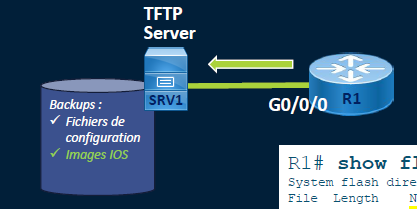
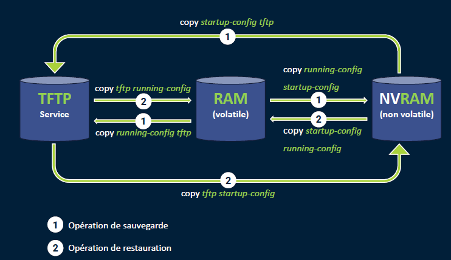

# TFTP**

## 💾 La commande copy – Transferts de fichiers (via TFTP)**

La commande copy permet de transférer des fichiers d’un emplacement à un autre sur un routeur/switch Cisco.

📍Les sources/destinations classiques :

- startup-config ←→ running-config
- running-config → tftp: (sauvegarde à distance)
- tftp: → startup-config (restauration)
- running-config → startup-config (enregistrement de la config en NVRAM)

📡 Tu peux **envoyer** ou **récupérer** des configs sur un **serveur TFTP distant** (très utile en formation ou en environnement centralisé).

🎯 Exemples : 
- **Sauvegarde** : `copy running-config tftp:`
- **Restauration** : `copy tftp: running-config` ou `copy tftp: startup-config`

## **🔁 Transfert de l'image IOS**

En plus de la config, tu peux carrément **sauvegarder l’image IOS** utilisée par ton équipement :

- `copy flash: tftp:` → Permet de **copier l’image IOS** (ex: .bin) vers un serveur TFTP
- Ça te sert à :
  - Faire une **sauvegarde** en cas de MAJ ratée
  - **Cloner** une image vers d'autres équipements
  - Garder une **version stable** à disposition

🔍 L’IOS est stocké dans la mémoire **flash**, c’est pour ça qu’on indique flash: comme source.

🧠 Astuce : toujours vérifier que le TFTP est joignable avant de lancer la commande (ping, interface up, etc.)

