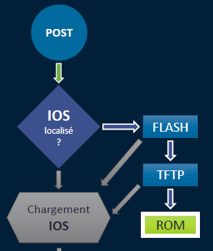

# Restauration&ROMmon17:40

**🔁 Restauration de la configuration depuis un TFTP**

Quand tu veux restaurer une config précédemment sauvegardée, tu fais :

- copy tftp: running-config → recharge directement dans la mémoire RAM
- Nécessite que l’équipement ait accès au serveur TFTP (connectivité réseau fonctionnelle)
- ⚠️ Ne remplace **pas** la startup-config sauf si tu l’écrases manuellement après !

🧠 Astuce : tu peux d’abord restaurer dans running-config, vérifier/modifier,

puis faire un copy running-config startup-config

**💿 Restauration de l’image IOS depuis un TFTP**

Si l’image IOS a été supprimée ou corrompue, tu peux la réinjecter avec :

- copy tftp: flash: → copie le fichier IOS vers la mémoire flash
- Fichier typiquement .bin
- Exécution depuis le mode **CLI** classique (pas ROMmon)

Prépare le nom du fichier, l’adresse IP du TFTP, et l’interface réseau active pour la comm.

**⚙️ Séquence de boot ROMmon – Vue d'ensemble**

Quand un routeur ne trouve pas d’IOS valide, il **bascule en ROMmon** (bootstrap mode) :

1.  Boot de la ROM (BIOS Cisco)
2.  Vérification du registre de config
3.  Recherche d’IOS en flash
4.  Si échec → bascule automatique en **mode ROMmon** (rommon >)

**🧭 Commandes de base en mode ROMmon**

En ROMmon, tu perds le CLI IOS classique. Tu as des commandes minimales :

- boot → tenter de booter manuellement un fichier
- confreg → changer le registre de config
- dir → lister les fichiers présents
- help → afficher la liste des commandes disponibles
- reset → redémarrer l’équipement
- set / unset → afficher/modifier les variables d’environnement
- tftpdnld → récupérer une image IOS depuis un TFTP (⚠️ efface toute la flash !)

**🛠️ Restauration IOS via tftpdnld (depuis ROMmon)**

Procédure à suivre quand **plus aucun IOS valide** n’est dispo sur l’équipement :

1.  Définir les variables réseau dans ROMmon : **IP_ADDRESS** = IP locale du routeur / **IP_SUBNET_MASK** = masque réseau / **DEFAULT_GATEWAY** = passerelle (si besoin de routage) / **TFTP_SERVER** = IP du serveur TFTP / **TFTP_FILE** = nom exact du fichier .bin
2.  Lancer : tftpdnld et Confirmer le message d’avertissement (effacement total de la flash !)
3.  Le fichier est téléchargé → reboot automatique une fois terminé 🧨 **Attention** : méthode à réserver aux **cas critiques**, car **elle efface tout** dans la flash

