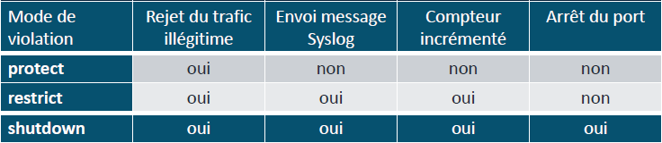

# Port-security/DHCP/STP

## **🔒 Sécurité de port – Port Security**

### **⚙️ Activation & vérification**

🔧 Activation sur une interface : `switchport port-security` *(se configure dans l'interface)*

🔍 Vérif config & état : `show port-security interface <id>`

→ Affiche **statut**, le **nb max**, les **violations**, etc.

### **🧠 Apprentissage des adresses MAC**

- `switchport port-security mac-address` :
  - `sticky` : apprend dynamiquement et enregistre la MAC
  - `static` : saisie manuelle fixe
- `switchport port-security maximum <nb>` : limite de MAC autorisées
- 🧾 Liste des adresses sécurisées : `show port-security address`

### **🚨 Modes de violation (si dépassement ou changement d’adresse)**

- **protect** 🔇 : bloque sans alerte, ne log pas, ne compte pas
- **restrict** 🚨 : bloque, log l'évènement, incrémente les violations
- **shutdown** ❌ : désactive l’interface (mode err-disabled) → C'est le **mode par défaut**

### **🛠️ Redémarrage d’une interface SecureShutdown** → Nécessite un **reset manuel**

💡 Cmds : `shutdown` puis `no shutdown` dans l’interface concernée

## **⚠️ Protection Spanning Tree**

### **🚧 Portfast**

Active le basculement immédiat du port en état forwarding (pas de délai STP)

**Commande :** `interface <id>` / `spanning-tree portfast`

À activer uniquement sur les ports vers des hôtes (PC, imprimantes), **jamais vers un autre switch**.

### **🛡️ BPDU Guard**

Si un BPDU est reçu sur un port portfast → shutdown immédiat

Protège contre les switchs branchés à l’arrache

**Commande :** `interface <id>` / `spanning-tree bpduguard enable`

### **🕶️ BPDU Filter**

Bloque l’envoi **et** la réception de BPDU.

⚠️ Dangereux : désactive complètement STP, risque de boucle si mal utilisé

**Commande :** `interface <id>` / `spanning-tree bpdufilter enable`

## **🧼 DHCP Snooping – Anti-Rogue DHCP**

Empêche un faux serveur DHCP de distribuer de fausses IP dans le réseau

### **🔐 Interface "Trust" ou "Untrust"**

Par défaut, toutes les interfaces sont **Untrust**

→ Les paquets DHCP offre ou ack sont **bloqués** sur ces ports.

Il faut définir les interfaces uplink vers **le vrai DHCP** comme **Trust** :

**Commande :** `interface <id>` / `ip dhcp snooping trust`

### **⚙️ Configuration globale :**

**Commandes :** `ip dhcp snooping`

`ip dhcp snooping vlan <vlan-id>`

→ Active DHCP Snooping **et** sur les VLANs concernés.

### **📉 Limiter le nombre de paquets DHCP par port :**

Empêche les attaques de type flood DHCP Discover :

**Commande :** `interface <id>` / `ip dhcp snooping limit rate <valeur>`

### **🕵️ Dynamic ARP Inspection (DAI)**

**🎯 But :** Empêche l'usurpation ARP (spoofing de MAC/IP) en croisant les requêtes ARP avec la base de DHCP Snooping.

**Commande globale :** `ip arp inspection vlan <vlan-id>`

→ Nécessite que DHCP Snooping soit activé.

**Pour "trust" les ports uplink :**

`interface <id>` / `ip arp inspection trust`

