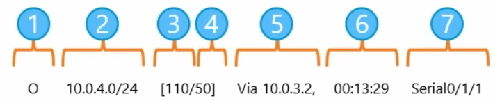

# Routage statique

## **🧭 Fonctionnement du routage statique**

Quand un hôte (ex : PC1) veut parler à un autre sur un réseau différent (ex : PC3), il :

- Identifie que la destination est **hors de son réseau local**
- Utilise la **passerelle par défaut** (interface du routeur, ex : R1 en 192.168.1.254)
- Envoie la trame avec l’adresse **MAC de la passerelle**
- Le routeur consulte sa **table de routage**
- Transmet vers le **prochain saut** (ex : interface de R2 en 172.16.255.253)
- Si le réseau destination est connecté à R2 → paquet livré
- Sinon → nouveau routage jusqu'à la destination (avec décrémentation du TTL)

### **🛣️ Types de routage**

- **Statique** : les routes sont **définies manuellement**, pas de partage entre routeurs (parfait pour les petits réseaux, les liaisons simples ou critiques)
- **Dynamique** : routes générées et échangées **automatiquement** entre routeurs (RIP, OSPF, EIGRP…)

## **🧑‍🔧 Création d'une route statique**

🧱 Pour une **route simple** vers un réseau : `ip route [réseau] [masque] [IP du prochain saut ou interface]`

👉 ex : `ip route 192.168.10.0 255.255.255.0 10.0.0.254`

🧱 Pour une **route par défaut** (fallback si rien d’autre ne correspond) : `ip route 0.0.0.0 0.0.0.0 [IP ou interface de sortie]`

➡️ Utilisée pour “tout ce qui n’est pas dans la table”

📊 Vérif : `show ip route` → ligne S* (statique + candidate par défaut) + Gateway of last resort.

## **🧾 Lecture d’une table de routage**

1.  **Source** : comment la route a été apprise (C, S, R, L...)
2.  **Destination** : réseau visé + préfixe (ex : 192.168.10.0/24)
3.  **Distance administrative** : fiabilité de la source
4.  **Métrique** : coût du chemin
5.  **Next-hop** : IP du routeur suivant
6.  **Horodatage** : temps écoulé depuis découverte (utilisé en dynamique)
7.  **Interface de sortie** : port utilisé pour envoyer le paquet

⚠️ Si aucune route n’est définie : Soit route par défaut = utilisé / Soit erreur ICMP envoyée à l’émetteur (host/network unreachable)

### **🌳 Routes parents et enfants**

- Une **route parent** regroupe des **routes enfants (Par classe)**
- Les **routes enfants** sont des sous-réseaux ou connexions directes
- Le L (local) indique que le routeur **possède une IP** dans ce réseau
- Une route connectée directe (via C) est toujours considérée comme enfant

