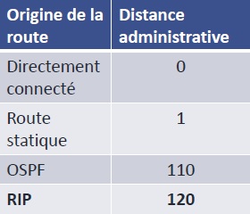

# Distances / Metriques

**📏 Distance administrative (AD) : la priorité des routes**

La **distance administrative** permet de déterminer **quelle route choisir** quand plusieurs chemins mènent au même réseau. Plus elle est **faible**, plus la source est **crédible**.  
- **🔹 Interface connectée** : 0,
- **🔹 Route statique** : 1,
- 🔹 **EIGRP (Interne)** : 90,
- 🔹 **OSPF** : 110,
- 🔹 **RIP** : 120

🧠 *Exemple :* Si une route vers un réseau existe à la fois en OSPF (AD 110) et en RIP (AD 120), **OSPF sera choisi**.

### **🛠️ Pourquoi la distance administrative ?**

Le routeur peut apprendre plusieurs chemins vers le même réseau via différents protocoles (RIP, OSPF, EIGRP...). Pour savoir lequel utiliser, il compare les **AD** de chaque route et choisit **la plus basse**.

⚠️ Ce n’est pas parce qu’une route dynamique est utilisée qu’elle est optimale en termes de rapidité, mais simplement que **sa source est jugée plus fiable**.

### **🔍 Vérification des routes**

Pour vérifier les routes dans la table : show ip route OU show ipv6 route

La sortie donne aussi une **légende** des routes listées. Tu peux y voir : 
- 🔹C : **Connectée directement,**
- 🔹L : **Interface locale dans le réseau**,
- 🔹S : **Statique**,
- 🔹O : **OSPF**,
- 🔹R : **RIP**,
- 🔹D : **EIGRP**,
- 🔹* : Candidat pour **route par défaut**

### **📌 Métrique vs Distance Administrative ?**

Les deux servent à **prendre des décisions de routage**, mais à deux niveaux :

- **AD (Distance Administrative)** : Sert à choisir **entre deux sources d'info** (ex : OSPF ou RIP).
- **Métrique** : Sert à choisir **entre deux routes issues d’un même protocole** (ex : deux routes RIP).

Donc : ➡️ **AD = choix du protocole**, ➡️ **Métrique = choix du chemin à l'intérieur du protocole**.

### **🧮 La métrique en routage : la boussole du trafic**

La **métrique** est la **valeur numérique** utilisée par un protocole de routage pour évaluer **le "coût" d’un chemin**.

📉 **Plus la métrique est faible, plus le chemin est jugé optimal.**

🔧 Tous les protocoles dynamiques l’utilisent, mais chacun **la calcule différemment** :

- **🧭 RIP** :
  - ↪️ **Nombre de sauts** (1 routeur = 1 saut)
  - 🚫 **Limite à 15 sauts** → au-delà, le réseau est **injoignable**
- **🚅 OSPF** :
  - ↪️ **Bande passante cumulée** sur le chemin
  - ⬇️ Plus la bande passante est élevée, **plus la métrique est faible**
  - 🐢 Une interface lente = chemin plus "cher"

👉 Résultat : **RIP privilégie les chemins les plus courts**, **OSPF privilégie les chemins les plus rapides**.

