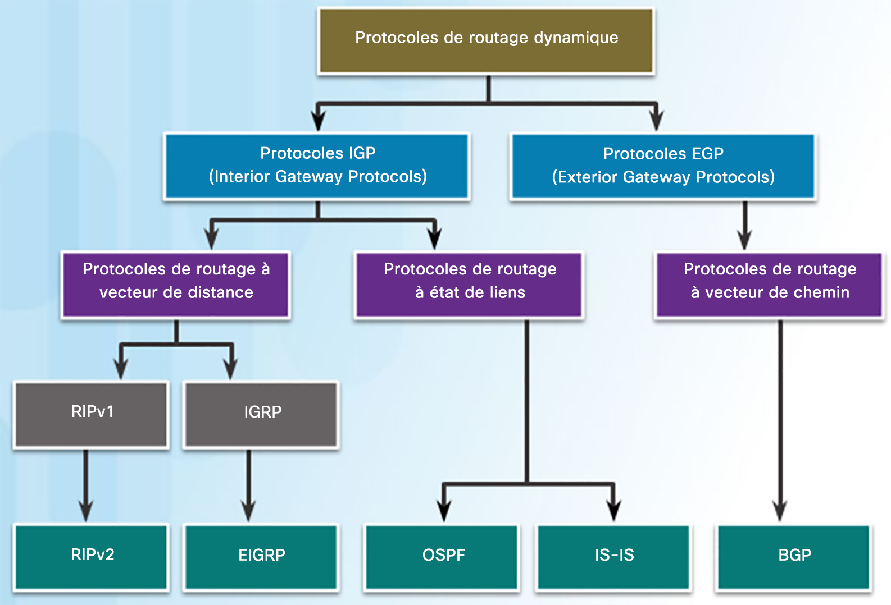

# Protocoles de routages

## **🔍 Vecteur de distance vs État de lien : deux visions du réseau**

Il existe **deux grandes familles** de protocoles de routage dynamique. Leur approche du réseau est très différente :

- **🧱 Vecteur de distance (ex : RIP, IGRP)** Le routeur **ne connaît que ses voisins**. Il partage sa table de routage **périodiquement**, sans réelle vision globale.

- **🌐 État de lien (ex : OSPF, IS-IS)** Chaque routeur **analyse son environnement**, puis partage un **état du réseau complet**. Tous les routeurs construisent **la même carte**.

