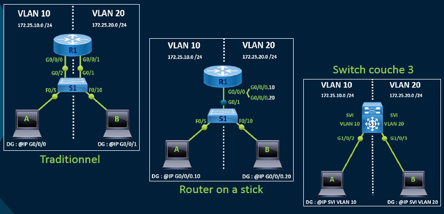

# Routage Inter-VLAN

### **🌐 Qu’est-ce que le routage inter-VLAN ?**

Le **routage inter-VLAN** permet à des équipements situés dans des VLANs différents de **communiquer entre eux**. Sans lui, chaque VLAN reste isolé.

### **🛠️ Trois méthodes pour le faire**

1.  **Routeur avec sous-interfaces** (a.k.a. « Router-on-a-Stick »)
2.  **Switch de niveau 3 (Layer 3)** avec interfaces SVI (Switch Virtual Interfaces)
3.  **Routeur avec 3 interfaces** (Traditionnel)

➡️ Choix selon la **taille du réseau** : un routeur pour les petits déploiements, un switch L3 pour les réseaux plus denses/complexes.

### **📥 Scénario typique (Router-On-a-Stick)**

📍 *Exemple* : PC1 (VLAN 10) veut parler à PC2 (VLAN 20).

Le chemin : PC1 → Switch 1 → Trunk → Routeur R1 → routage inter-VLAN → retour via trunk → PC2.

🧠 **Point clé** : le trunk **transportera les trames taguées** avec les VLANs (802.1Q).

## **🔧 Configuration routeur-on-a-stick : sous-interfaces**

Chaque VLAN = 1 sous-interface avec 2 éléments à configurer :

- `encapsulation dot1Q VLAN_ID [native]`
- `ip address IP SUBNET_MASK`

### 🛠️ Exemple rapide :

Gi0/1.10 (VLAN 10) → IP 192.168.10.1

Gi0/1.20 (VLAN 20) → IP 192.168.20.1

💡 Le **dot1Q** indique le marquage VLAN 802.1Q.

À préciser si le VLAN est **natif** (non tagué).

## **🔍 Vérifications essentielles**

Utilise ces commandes pour diagnostiquer :

- `show ip route` : routes apprises/connues
- `show ip interface brief` : état général IP
- `show interfaces` : état physique/logique
- `show interfaces trunk` : vérifie le trunking

🧠 *Check-list rapide* : → VLANs créés ✅ → Trunk actif ✅ → Sous-interfaces IP OK ✅ → Pings inter-VLAN OK ✅

