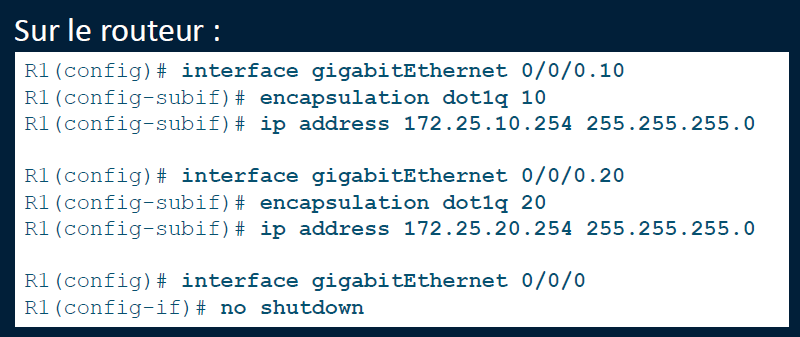
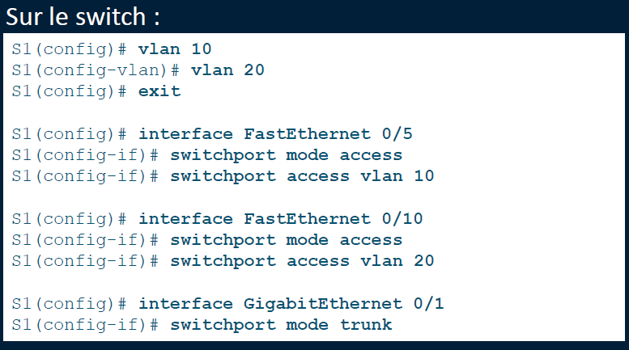

# Router On a Stick

**🧪 Méthode 1 : Router-on-a-Stick (Routage via sous-interfaces)**

🧵 **Principe** : une seule interface physique sur le routeur gère plusieurs VLANs via des *sous-interfaces*

🧰 **Sur le routeur** :

- Créer une **sous-interface par VLAN** (ex : G0/0.10, G0/0.20)
- Activer **l’encapsulation 802.1Q** sur chaque sous-interface
- Associer une **IP passerelle** par VLAN
- Activer l'interface mère (no shutdown)

🧰 **Sur le switch** :

- Créer les VLANs
- Associer les ports aux bons VLANs
- Configurer le **port trunk** vers le routeur (celui qui transporte tous les VLANs)

⚡ ➤ *Méthode très utilisée en prod ou en labo : économe en interfaces, facile à configurer*

