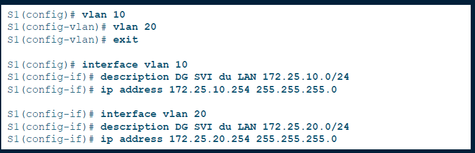
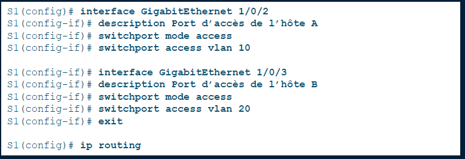

# Switch L3

## **🧠 Méthode 2 : Switch de couche 3 (avec interfaces SVI)**

🚀 **Principe** : le switch lui-même fait office de routeur ! Plus besoin de routeur externe.

### 🧰 **Sur le switch (de niveau 3)** :

- Créer les VLANs
- Associer les ports aux VLANs
- Créer une **SVI (interface virtuelle)** pour chaque VLAN (interface vlan 10, ip address ...)
- Activer **le routage IP** (ip routing)

💡 ➤ *Solution moderne, ultra performante, adaptée aux grandes infrastructures*

