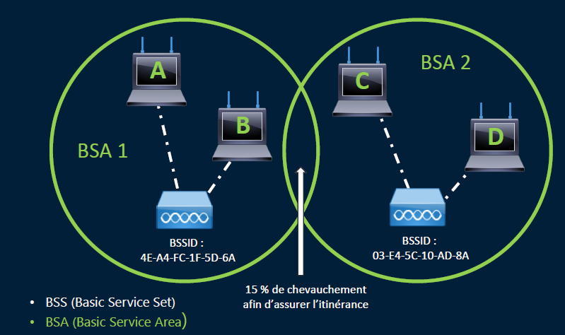
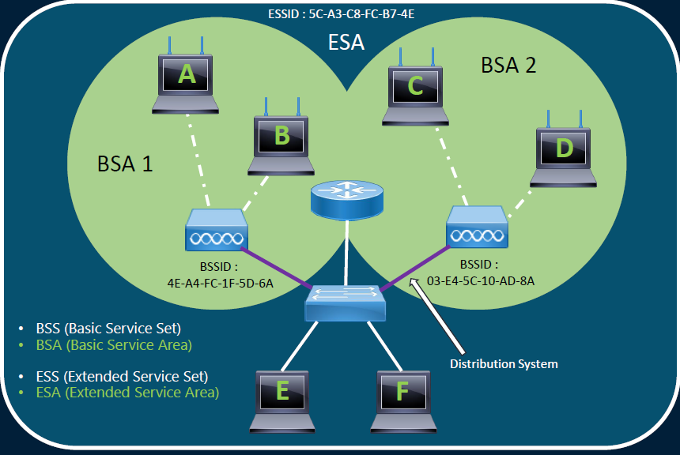

# Topologies

## **🏗 Topologie réseau Wi-Fi : BSS & ESS**

**Basic Service Set (BSS)**
➡️ Un seul point d’accès + ses clients.

## **Extended Service Set (ESS)**

➡️ Plusieurs points d’accès avec le **même SSID**, reliés au même réseau. Permet la **mobilité transparente** entre APs.

**🆔 Identifiants du réseau Wi-Fi**

📛 **SSID** : Nom visible du réseau Wi-Fi

🆔 **BSSID** : Identifiant unique d’un AP (adresse MAC)

📶 **ESSID** : Même SSID partagé sur plusieurs APs dans un ESS

Un AP peut diffuser **plusieurs SSID**, et **plusieurs APs peuvent diffuser le même SSID** pour étendre la couverture.
