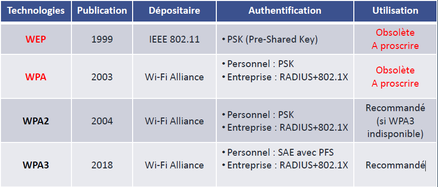

# Sécurité/WPA**🛡️ Recommandations de l’ANSSI (Agence nationale de la sécurité des systèmes d'information)**

L’**ANSSI** fournit un ensemble de **23 mesures de sécurité** pour les réseaux Wi-Fi. Voici les principales à retenir :

- 🔌 Activer le Wi-Fi **uniquement en cas de besoin**
- 🔄 **Désactiver l’association automatique** à un point d’accès
- 🔥 **Bloquer les connexions entrantes** via le **pare-feu local**
- 🔐 **Utiliser un chiffrement robuste** → WPA2 ou WPA3 + **AES**
- 🏷️ **Changer le SSID par défaut** pour éviter les attaques ciblées
- 📴 **Désactiver le WPS** (Wi-Fi Protected Setup), souvent vulnérable
- 👥 Mettre en place un **réseau invité séparé**, isolé du réseau principal

💡 Ces bonnes pratiques sont essentielles pour **réduire la surface d’attaque** et éviter les connexions malveillantes.

**🔐 WPA : technologies de sécurité Wi-Fi**

Les mécanismes de sécurité Wi-Fi ont évolué, avec plusieurs générations. L’idée est de **chiffrer les échanges** et d’**authentifier les utilisateurs**.

📌 Quelques notions clés :

- **PSK** = mot de passe partagé
- **SAE** (Simultaneous Authentication of Equals) : remplace PSK, plus résistant aux attaques par dictionnaire
- **PFS** (Perfect Forward Secrecy) : même si un mot de passe est compromis, les anciennes sessions restent protégées

