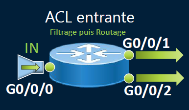
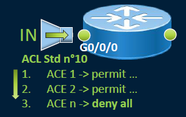

# Access Control List

Une **ACL (Access Control List)** est un outil pour **filtrer le trafic** sur un routeur ou un switch de niveau 3. Elle te permet de :

- ✅ Autoriser ou ❌ bloquer du trafic entre une **source** et une **destination**
- 🧾 **Classer** le trafic pour des fonctions comme la **QoS**
- 🔁 Faire du **Source NAT** (traduction d’adresses)
- 🔧 Restreindre l’**accès administratif** à l’équipement

Chaque ACL contient des **ACE (Access Control Entries)**, qui sont des règles **appliquées ligne par ligne** à chaque paquet.

📦 Chaque **paquet IP** est comparé à ces entrées **dans l’ordre**, et dès qu'une correspondance est trouvée → l’action est appliquée (permit/deny).

⚠️ Par défaut, toute ACL se termine par une règle **implicite de refus** (même si tu ne l’écris pas).

## **🚦 Filtrage de paquets : niveau OSI & sens**

📍 Fonctionne au niveau **3 (IP)** et **4 (TCP/UDP)** du modèle OSI.

🛣️ Le filtrage est **directionnel** : **Entrant (in)** : paquet qui entre dans l’interface / **Sortant (out)** : paquet qui en sort

➡️ Tu peux appliquer **1 seule ACL entrante** *et/ou* **1 seule ACL sortante** par interface.

## **🧬 Types d’ACL**

Deux types à connaître :
- 🎯 **ACL standard** : filtre sur l’**adresse IPv4 source (L3) (de 1 à 99 et 1300 à 1999)**
- **ACL étendue** : filtre sur **source + destination IPv4** + **ports TCP/UDP (L3/L4) (de 100 à 199 et 2000 à 2699)**

### **🧾 Nommage des ACL : deux styles**

Il existe 2 syntaxes pour créer des ACL :

- `access-list <numéro> ...` : méthode classique (numérotée)
- `ip access-list standard <nom>` : méthode **nommée**, plus lisible, plus souple (tu peux éditer ligne par ligne)

## **🔁 Traitement d’une ACL standard**

Voici comment une **ACL standard** fonctionne, étape par étape 🧩 :

1.  🔍 Regarde l’**IP source** du paquet
2.  🔁 Compare à chaque **ACE** dans l’ordre ✅ Autorise ou ❌ bloque
3.  🚫 Si aucune correspondance → **refus implicite**

🧠 Les ACL standard ne filtrent que sur l’**IP source**.

Pour des règles plus fines (IP destination, port, protocole), il faut des **ACL étendues**.

## **🎭 Masques génériques/inversé (Wildcard)**

Utilisés pour **définir des plages d’adresses** dans les ACL. 

➡️ Le **masque générique(inversé) = inverse du masque de sous-réseau**

Exemples : 193.62.31.64/26 → masque 255.255.255.192 → wildcard = **0.0.0.63 /** 193.62.31.64/24 → wildcard = **0.0.0.255**

➡️ Pour filtrer plusieurs sous-réseaux : 

Réseaux 192.168.16.0 à 192.168.31.255 → wildcard = **0.0.15.255** 

ACL typique : `ACCESS-LIST 10 PERMIT 192.168.16.0 0.0.15.255`

**Mots clés** :
-  **HOST** = masque **0.0.0.0** → cible **1 seule IP**
- **ANY** = masque **255.255.255.255** → autorise **toutes les IP**

➡️ Pratiques pour **simplifier** l’écriture des ACLs.

### **💡 Bonnes pratiques ACL**

- ✅ Suivre la **stratégie de sécurité** de l’entreprise 
- ✅ **Préciser clairement** l’objectif de chaque ACL
- ✅ Éviter les erreurs d’accès accidentelles
- ✅ Rédiger et stocker les ACL dans un **éditeur de texte** pour réutilisation
- ✅ Bien **placer l’ACL** selon le sens du trafic
