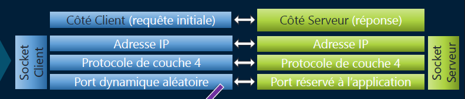
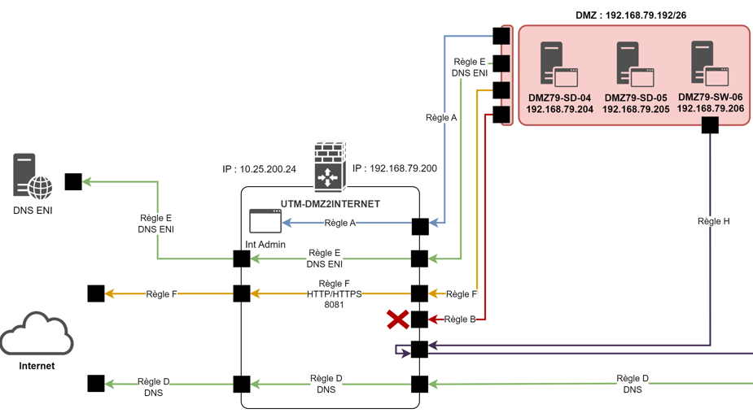

# Matrice de flux

**🌊 C’est quoi un flux réseau ?**

Un **flux**, c’est un **ensemble de paquets** qui ont en commun trois éléments clés :

- 📍 **Source** : IP (et parfois port) d'origine
- 🎯 **Destination** : IP (et parfois port) de destination
- 📡 **Protocole** : TCP, UDP, ICMP, etc.

➡️ En gros, un **flux** représente **une communication réseau unique** entre deux points. C’est comme une « conversation » entre deux machines 📞

## **🔌 Les sockets : l’identifiant d’un flux**

Une **socket**, c’est l’**identité d’un flux** côté client ou serveur.

🧩 Une socket = **3 éléments** (triade) :

- 🏷️ Adresse IP
- 📦 Protocole de transport (TCP ou UDP)
- 🔢 Port

🎙️ Côté **client** :

- IP du client
- Port **dynamique aléatoire** (>1024)
- Protocole (souvent TCP ou UDP)

🖥️ Côté **serveur** :

- IP du serveur
- Port **réservé** à l’application (ex : 80 pour HTTP, 443 pour HTTPS)

🧠 Une connexion réseau = **paire de sockets** (client ↔ serveur)

## **🧮 La matrice de flux : visualiser les échanges**

La **matrice de flux**, c’est un tableau qui **recense tous les flux** d’un système,

d’un réseau, ou d’une appli distribuée.

📋 Elle contient généralement :

- 🔵 Source : IP / VLAN / nom de machine
- 🟢 Destination : idem
- 🔐 Protocole : TCP, UDP, etc.
- 🔢 Ports utilisés
- ↔️ Sens (entrant / sortant)

📌 Ça sert à **cartographier les communications**, comprendre les **besoins réseau réels**, et **créer des règles de sécurité** précises (ACL, firewall, etc.)

