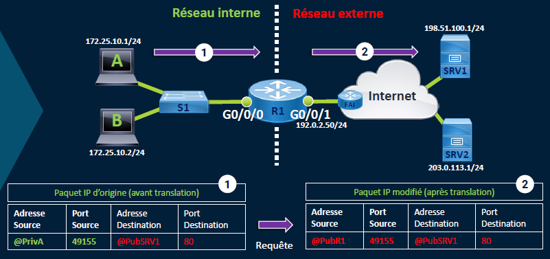

## **🔄 NAPT Dynamique (Source NAT) – Comment ça marche ?**

Le **NAPT dynamique**, c’est le **NAPT appliqué à la source** :

- Quand un **hôte privé initie une connexion sortante**, son **adresse IP source + port source** sont remplacés par **l’adresse publique du routeur + un port libre**.
- Le routeur garde une **table de correspondance** pour gérer les réponses.
- Chaque nouvelle session utilise un **port différent**, même si c’est le **même hôte**.

🧠 Exemple : 192.168.1.10:1034 → IP_publique:40000 / 192.168.1.11:1034 → IP_publique:40001

🎯 Ce processus permet de **multiplexer plusieurs connexions privées vers Internet via une seule IP publique**.

## **🔁 Translation Inversée (Destination NAT)**

Quand le **trafic revient**, le routeur fait le boulot inverse :

- Il utilise la **table de translation NAT** pour savoir à **quel hôte interne** renvoyer les données.
- L’adresse **destination IP + port** est réécrite pour correspondre à **l’IP privée et au port original**.

📌 C’est ce mécanisme qui garantit le bon **routage des réponses**, même avec des centaines de sessions actives.

## **⚙️ Configuration NAT dynamique sur Cisco IOS**

- 🏠 `ip nat inside` → Définit l’**interface interne** (côté LAN)
- 🌐 `ip nat outside` → Définit l’**interface externe** (côté WAN)
- 🧾 `access-list 5 permit 172.25.10.0 0.0.0.255` → Crée une **ACL** qui cible les IP internes autorisées à sortir
- 🔁 `ip nat inside source list 5 interface g0/0/1 overload` 
  → Crée une **translation dynamique** (avec surcharge = NAPT)  
  → Les IP de l’ACL seront traduites via l’IP publique de l’interface WAN

🎯 L’option **overload** est ce qui rend possible la **multiplexation via les ports** (MAPT).

### **🔍 Vérification NAT sur IOS**

🧮 `show ip nat translations` → Affiche la **table active** des translations (IP privée ↔ IP publique)

📊 `show ip nat statistics` → Montre les **stats NAT** (nb de translations actives, hits, misses, etc.)

Très utile pour **déboguer** ou **suivre l'activité NAT** en temps réel.

