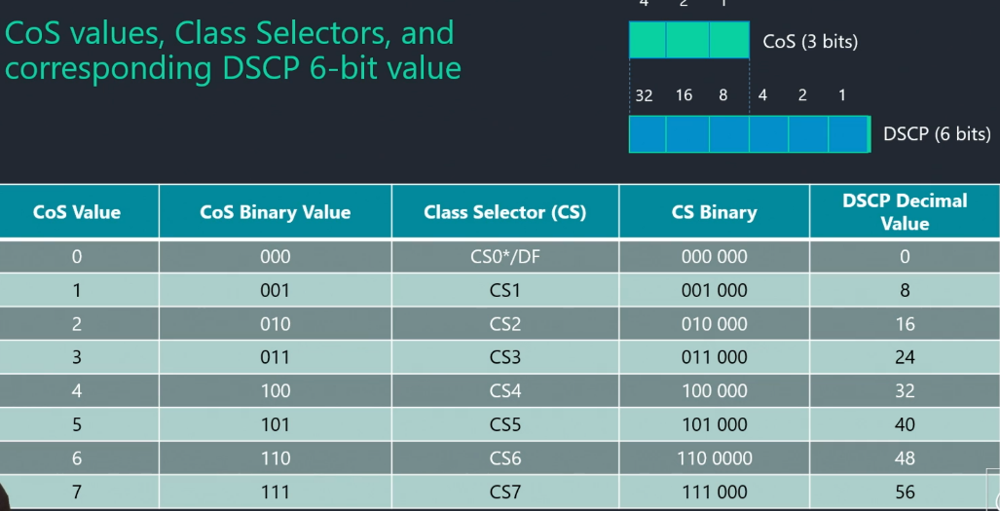
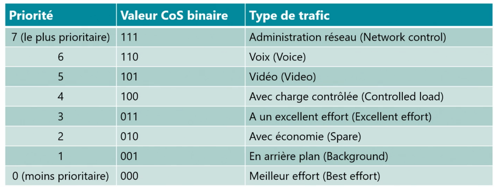

# QoS

**📌🚀 Pourquoi la QoS est indispensable ?**

- **Best effort** = "au mieux", sans garantie → suffisant pour les e-mails ou fichiers, **mais insuffisant pour voix/vidéo**
- **QoS = nécessaire** pour assurer qualité, priorité, et fluidité des flux sensibles
- **Sans QoS → congestion, latence, coupures** = expérience utilisateur dégradée
- ⚠️ Pour être efficace, elle doit être appliquée **de bout en bout**, sur **tous les équipements intermédiaires**

### **🎯📊 Objectifs & paramètres à surveiller**

La QoS agit sur 4 grandes **caractéristiques réseau** :

- **Bande passante** : débit disponible (en Mbps/Gbps)
- **Délai (latence)** : temps d’acheminement d’un paquet
- **Gigue** : variation des délais entre les paquets
- **Perte de paquets** : paquets envoyés ≠ paquets reçus

👉 Pour la **VoIP** : latence < 100 ms, gigue < 20 ms, pertes < 1 %

### **🧱⚙️ Principes généraux de la QoS**

1.  **Classification & marquage** : identification des flux (voix, vidéo, data)
2.  **Prévention de congestion** : suppression proactive de paquets (ex : TCP qui peut les renvoyer)
3.  **Gestion de congestion** : mise en file d’attente avec règles de **priorité**

🎯 Objectif : **fluidifier** le trafic critique, sans bloquer le reste

## **🗂️📶 Où s’applique la QoS ?**

✅ **Niveaux OSI concernés** :

- **Couche 2** : via 802.1p (intégré à 802.1q) → tagging dans les trames VLAN
- **Couche 3** : via **DSCP** dans l’en-tête IP (ex-champ ToS)
- **Couches 4/5** : utilisation de protocoles spécifiques (FTP, RTP…)

💡 Le marquage se fait selon le **contexte réseau** (type d’équipement, support utilisé)

### **🧬📡 Focus sur la trame Ethernet 802.1Q**

- **Adresse MAC Dest/Source** : identification des hôtes
- **TPID (0x8100)** : indique une trame VLAN
- **TCI** : contient 3 champs ➜
  - **Priorité (3 bits)** : 8 niveaux (de 0 à 7, selon l’urgence)
  - **CFI (1 bit)** : pour compatibilité
  - **VLAN ID (12 bits)** : jusqu'à **4096 VLANs**

👉 La priorité (802.1p) permet de **différencier les flux critiques** (ex : VoIP = niveau 5 ou 6)

### **🧠📌 DSCP (Differentiated Services Code Point)**

- Présent dans l’en-tête IP (champ ToS)
- Permet une **granularité + fine** que 802.1p → 64 classes possibles
- Transportable de bout en bout entre équipements compatibles IP

🎯 Utilisé dans les **architectures réseau modernes** (entreprises, opérateurs)

### **🛠️📏 Surveillance & ajustements continus**

- Il faut **mesurer régulièrement** la QoS (latence, gigue, pertes)
- **Adapter les règles** selon l’évolution du trafic et des services
- Anticiper la saturation pour garantir la **qualité perçue** par les utilisateurs

