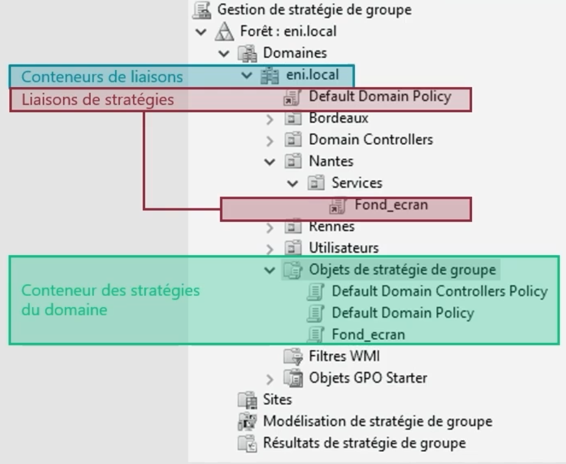

# Ciblage des GPO

Une **GPO est liée à un objet AD** pour s’appliquer :

🔹 **Site** AD (niveau géographique/réseau)

🔹 **Domaine** (global)

🔹 **OU (Unité d’organisation)** (ciblage fin)

💡 La GPO **agit uniquement sur les objets "utilisateur" et "ordinateur"**.

❌ **Les groupes** ne peuvent pas être ciblés directement.

➡️ Toujours lier une GPO à une OU contenant des objets actifs (users/PC).

## **🖥️ Console MMC – Gestion des liaisons**

La **console GPMC** (Group Policy Management Console) affiche :

🔹 **Bleu** : domaines/OU (ex: ENI.local)

🔹 **Rouge** : liaisons de GPO (où les GPO sont actives)

🔹 **Vert** : liste globale des GPO disponibles

👍 Vue centralisée, claire, idéale pour organiser et suivre les politiques.

## **📚 Ordre d’application et héritage**

🧬 L’ordre d’application suit cette logique :

1.  **Héritage** du parent (domaine) vers l’enfant (OU)
2.  **Stratégies du conteneur courant** après l’héritage
3.  **GPO marquée "Appliquée"** prend le dessus
4.  Si plusieurs GPO à même niveau ➡️ celle avec l’**ordre le plus élevé** s’applique en dernier = **prioritaire**

🎯 **Dernière GPO appliquée = celle qui l’emporte** si conflit sur le même paramètre.

## **⚠️ Conflits et fusion de paramètres**

👥 Un objet peut recevoir **plusieurs GPO en même temps** :

➡️ Si paramètres différents → **fusion** (cumul des effets)

➡️ Si mêmes paramètres → **la dernière GPO appliquée** remplace les autres

🎯 D’où l’importance du bon **ordre d’application** !

## **🛡️ Restrictions & Filtres**

🔒 **Blocage d’héritage** : désactive l’application des GPO héritées sur une OU ✅ À activer seulement si nécessaire, pour éviter de casser une stratégie globale

🚨 **Statut "Appliqué"** (Enforced) : force une GPO à passer **même si l’héritage est bloqué**

🔍 **Filtres de sécurité** : via les permissions NTFS → GPO visible/appliquée uniquement aux groupes/autorisations définis

🧪 **Filtres WMI** : filtrage via requêtes système (ex: OS = Windows 11, RAM > 4Go, etc)

➡️ Utiles pour cibler précisément selon les **caractéristiques du poste**

