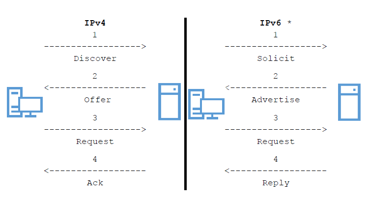

# **🔧 Fonctionnement général du service DHCP**

Le **DHCP (Dynamic Host Configuration Protocol)** est un service qui permet d’**attribuer automatiquement des paramètres réseau** aux équipements :

➡️ **Adresse IP**, **masque**, **passerelle**, **DNS**, **domaine**, etc.

✅ Objectif : éviter les configurations manuelles → **gain de temps**, **zéro erreur**, **centralisation** des configs.

🧩 Ce protocole est **standardisé par des RFC** (2131 notamment), donc **interopérable** entre systèmes.

📡 Il optimise l’usage de la plage IP, grâce à une **base de baux** (leases) gérée par le serveur.

⚡ En cas de modification de config, un simple changement sur le **serveur DHCP** → mise à jour automatique sur les clients.

## **🔁 Le cycle DORA : les 4 étapes d'une attribution IP**

Quand un client arrive sur le réseau sans IP, il suit ce **processus d’échange** avec un serveur DHCP :

1.  **DHCP Discover** 🔍  
    Le client envoie un *broadcast* (UDP 67 → 68) pour demander une IP. Il ne connaît ni sa propre IP, ni celle du serveur.

2.  **DHCP Offer** 📦  
    Le serveur répond en *broadcast* avec une **offre d’IP** + infos réseau disponibles.

3.  **DHCP Request** 📝  
    Le client accepte l’offre et demande explicitement à utiliser cette IP.

4.  **DHCP ACK** ✅  
    Le serveur valide le bail → le client peut utiliser l’IP pendant une durée définie.

🧠 Si plusieurs serveurs sont présents, le client choisit **l’offre la plus rapide** (en général) → mais **un seul serveur doit gérer une plage donnée** pour éviter les conflits.

## **🖥️ Solutions de serveur DHCP sous Linux**

Deux solutions principales, toutes deux supportées par **ISC (Internet Systems Consortium)** :

- **isc-dhcp-server** 🧱  
  ➕ Stable, très répandu, simple à configurer  
  ➖ Ne reçoit plus de mises à jour majeures (projet en maintenance)  
  🔧 C’est celui utilisé dans ce cours.

- **kea** 🚀  
  ➕ Moderne, performant, conçu pour le cloud  
  ➖ Plus complexe, encore peu utilisé, config JSON plus verbeuse
