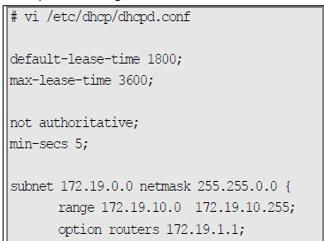

# **🧠 Objectif : Continuité de service DHCP**

En cas de panne du **serveur principal DHCP**, l'idée est d'avoir un **second serveur (de secours)** qui prend temporairement le relais, pour que les machines continuent à recevoir une IP.

➡️ On parle ici de **répartition de charge minimale** (≠ haute dispo active-active).

## **📊 Répartition des baux : la règle du 80/20**

🧮 Typiquement, on divise la **plage d’adresses IP** ainsi :

- 🧑‍💻 Serveur principal : 80 % des IPs
- 👨‍🔧 Serveur de secours : 20 % des IPs

➡️ Par exemple, sur un pool de 500 adresses :

- Principal : 450 adresses
- Secours : 50 adresses

⚠️ Le serveur secondaire **n’a pas vocation à tout distribuer**, il **dépanne temporairement**.

## **🐢 Délai volontaire de réponse (min-secs)**

Pour **prioriser** le serveur principal, on peut retarder volontairement le secours grâce à :

- `min-secs 5` ➜ attend 5 secondes avant de répondre à une requête DHCP  
  ➡️ Si le principal est up, il répondra **avant**.

## **⚙️ Extrait de conf typique du DHCP "secours"**

Voici ce qu’on y met en général :
- `default-lease-time 1800`,
- `max-lease-time 3600` ➜ baux courts (30min à 1h)
- `not authoritative` ➜ ce serveur ne s’impose pas comme autorité (évite conflits)
- `min-secs 5` ➜ temporisation pour laisser le principal agir

