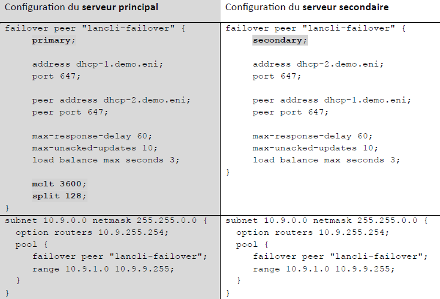
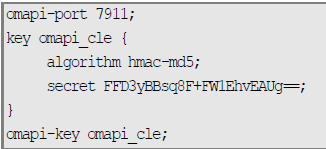

# DHCP Failover**🌐 DHCP Failover : principe**

Le **DHCP Failover** permet à **deux serveurs** de gérer **la même plage IP**, en se **synchronisant en temps réel**. Avantages :

- 📶 Haute tolérance de panne : si un tombe, l’autre prend le relais
- 🔄 Meilleure gestion d’adresse : pas de perte de plage comme avec un simple split 80/20
- ⚖️ Répartition de charge : configurable avec split

**🛠️ Directives principales (vue standard)**

Chaque serveur a un bloc failover peer identique sauf primary / secondary. Principaux paramètres :

- address, peer address, port, peer port ➜ adresses et ports des deux serveurs
- max-response-delay : après combien de sec. sans nouvelle du partenaire, on le considère down (ex : 60)
- max-unacked-updates : nombre d’updates envoyés sans ACK avant pause (ex : 10)
- load balance max seconds : délai max avant réponse hors failover (ex : 3 sec)
- mclt (Max Client Lead Time) : durée autorisée pour renouveler un bail de l'autre serveur (ex : 3600 sec)
- split : % de charge du serveur principal (0-255), 128 = équilibré, + élevé = + de clients pour le primaire

🧪 Exemple : split 128 ➜ chaque serveur gère environ 50% des clients, équilibré.

**🧰 Pool DHCP partagé**

Dans la section subnet, on trouve :

- failover peer "lancli-failover" ➜ identifie le bloc de synchronisation à utiliser
- range commun aux deux serveurs ➜ même plage IP distribuée par les deux, mais en synchro.

**🔐 Sécurisation des échanges (OMAPI)**

Pour éviter qu’un tiers malveillant intercepte ou injecte des infos entre les deux serveurs :

- omapi-port 7911 : port d’écoute sécurisé
- key omapi_cle { algorithm hmac-md5; secret ... } : clé de signature
- omapi-key omapi_cle : clé utilisée pour sécuriser les échanges

📌 Clé générée via dnssec-keygen (outil BIND) avec un secret de type base64.

