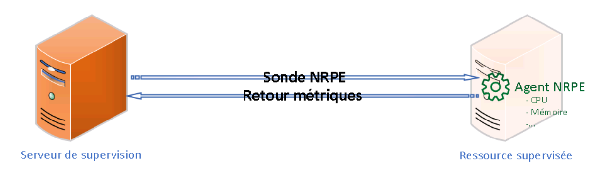

# NRPE

NRPE (Nagios Remote Plugin Executor) est un protocole client-serveur utilisé pour *exécuter des plugins à distance* depuis un serveur de supervision (comme Centreon ou Nagios) vers un hôte (Windows/Linux). 

Il permet de superviser des *ressources locales* non accessibles via SNMP (ex: CPU, RAM, disque, services). 📌 Points clés :

- Alternative à SNMP, surtout utile pour les systèmes Windows (SNMPv3 peu utilisé sur Windows).
- Communication *sécurisée via SSL/TLS* (contrairement à SNMPv2).
- Né pour Nagios, mais utilisé aussi dans Centreon.

## 🧰 **Fonctionnement global**

🖥️ Serveur de supervision → 💬 envoie une requête NRPE → 🎯 l'agent NRPE de l'hôte exécute un plugin local → 📊 renvoie la métrique

📍 Fonctionne sur port 5666 (TCP, configurable)

### 🔐 **Architecture client/serveur & sécurisation**

- L’agent NRPE (démon) tourne sur l’hôte supervisé.
- Le serveur de supervision initie la connexion (client).
- La communication peut être *chiffrée SSL* (selon config).
- ⚠️ Le port 5666 doit être ouvert dans les pare-feu.

### 🧩 **Plugins NRPE : où, quoi, comment ?**

- Les *plugins* sont des scripts (bash, exe, etc.) exécutés par l'agent NRPE sur demande.
- Par défaut, NRPE permet *uniquement l’exécution locale* de plugins.
- On peut l’utiliser pour superviser : charge CPU, RAM, espace disque, état de services, etc.
- Plugins personnalisables et facilement déployables selon les besoins.

## 🖥️ **Installation & déploiement des agents**

### 💡 Sur **Linux** :

- Installer nrpe + nagios-plugins
- Configurer /etc/nagios/nrpe.cfg
- Autoriser les IP du superviseur dans la directive allowed_hosts

### 💡 Sur **Windows** :

- Utiliser **NSClient++** (équivalent NRPE pour Windows)
- Configurer nsclient.ini (activer NRPE, définir les modules/commandes)
- Déploiement possible via GPO, scripts, ou outils comme Ansible/PDQ.

## 📟 **Client côté serveur**

Le serveur doit posséder le plugin NRPE (souvent check_nrpe) pour interroger l’agent. Exemple de commande : check_nrpe -H 192.168.1.50 -c check_load

📌 Ce plugin est *exécuté par le moteur de supervision* (Nagios/Centreon) lors de chaque vérification de service.

