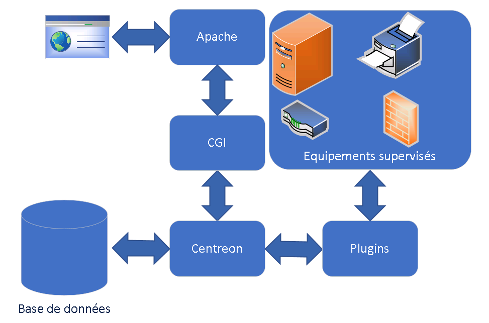

# Installation/Architecture

**🧩 Méthodes d'installation de Centreon**

Centreon peut être installé de **4 manières** selon le besoin :

- **ISO officiel** : méthode la plus simple pour tester rapidement Centreon sur VM ou machine physique.
- **Paquets (RPM)** : pour les distributions *Red Hat-based* (Rocky, Oracle, Alma…). ⚠️ CentOS est à oublier !
- **VM préinstallée** : images fournies par Centreon pour VMware, VirtualBox, etc.
- **Compilation depuis les sources** : pour les barbus 😄 ou ceux qui veulent l’installer sur Debian/Ubuntu (cf. Sugarbug).

✅ **Méthodes recommandées** : ISO ou paquets, car simples, documentées et stables.

### **📚 Ressources utiles**

- 🔗 Doc officielle :  
  <https://docs.centreon.com/current/fr/installation/introduction.html>

- 🔗 Guide Sugarbug (Debian 11 + sources) :  
  <https://www.sugarbug.fr/atelier/installations/debian/debian11_centreon_2104/>

## **🏗️ Architecture de Centreon**

Centreon repose sur plusieurs **briques logicielles** bien séparées :

- **Centreon Engine** : moteur de supervision, exécute les checks en tâche planifiée.
- **Base de données** : MySQL ou MariaDB (stocke : hôtes, services, historique, conf...).
- **Centreon Web** : interface web, tourne sur Apache + PHP.
- **Plugins** : sondes externes exécutées pour chaque supervision. Fournis/ajout manuel.

🔁 Tous ces éléments interagissent ensemble pour superviser l’infra.

## **🔌 Plugins et sondes externes**

Centreon **ne supervise rien par lui-même**. Il délègue tout à des **plugins** (comme Nagios) :

⚙️ Ce sont des **scripts exécutables** (Perl, Bash, Python, PowerShell, etc.).

🖥️ Lancement local sur le serveur Centreon ou distant (via SSH, NRPE…).

🎯 Chaque plugin fait un **check spécifique** (disque, RAM, ping, service, etc.).

➕ On peut en ajouter autant qu’on veut, en les téléchargeant ou en les développant soi-même.

### **Solutions alternatives :**

IBM Tivoli Software / ICINGA / HP Openview / SHINKEN / BMC Software / NAEMON / Zabbix / Nagios

