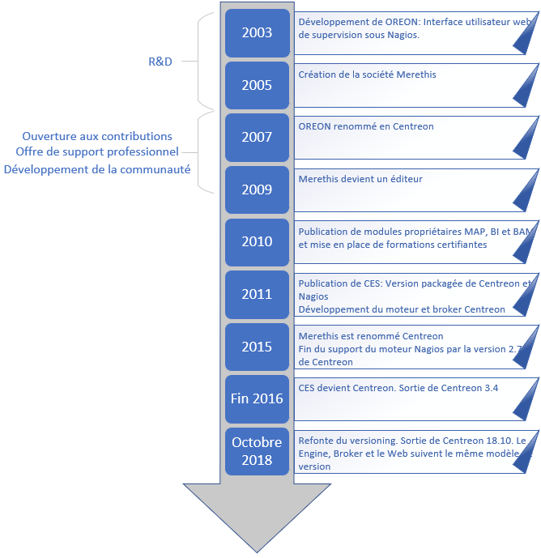

# Historique**🔧 Les débuts : NetSaint ➡️ Nagios (1999)**

- **NetSaint** (1999) devient **Nagios** peu après.
- C’est **un ordonnanceur de tâches** : exécute périodiquement des commandes, collecte des données, génère des **alertes** et envoie des **notifications**.
- Configuration exclusivement via fichiers .cfg (manuel, verbeux, mais très flexible).

**🌍 Arrivée d’Oreon, futur Centreon (2003 à 2007)**

- **2003** : Naissance d’**Oreon** par la société **Merethis**, sous licence **GNU GPL v2**.
- Objectif : **interface graphique web** pour Nagios (visualisation, configuration facilitée).
- **2005** : Fondation officielle de **Merethis** pour structurer la communauté.
- **2007** : Renommage d’Oreon en **Centreon**, suite à un conflit de nom international.

**🔌 Extension progressive de Centreon (2009-2012)**

- Développement de **modules complémentaires** :
  - **Centreon Map** (cartographie),
  - **Centreon MBI** (reporting / BI),
  - **Automatisation**, etc.
- Centreon devient plus qu’une surcouche : une **véritable solution de supervision**.

**⚙️ Indépendance technologique (2011-2012)**

- **Problème** : Nagios stagne → apparition de forks (Icinga, Shinken…).
- Merethis crée ses propres composants :
  - **Centreon Engine** (remplace Nagios comme moteur),
  - **Centreon Broker** (remplace les NDO Utils de Nagios).
- Objectif : **contrôle total**, meilleure **intégration**, simplification de l’architecture.

**🧩 Écosystème complet Centreon (post-2012)**

- Architecture désormais centrée sur :
  - **Centreon Web** (interface graphique),
  - **Centreon Engine** (ordonnanceur),
  - **Centreon Broker** (gestion de flux d’événements),
  - **Plugins Centreon**, avec de nombreuses extensions intégrées.

**🏷️ Renommages et versioning (2015 à aujourd’hui)**

- **2015** : Merethis devient **Centreon**.
- **2016** : Centreon (interface) renommé **Centreon Web**.
- **2018** : Changement de **versioning** : année.mois (ex : 18.10 pour octobre 2018).
  - Versioning unifié sur tous les composants (Web, Engine, Broker…).

