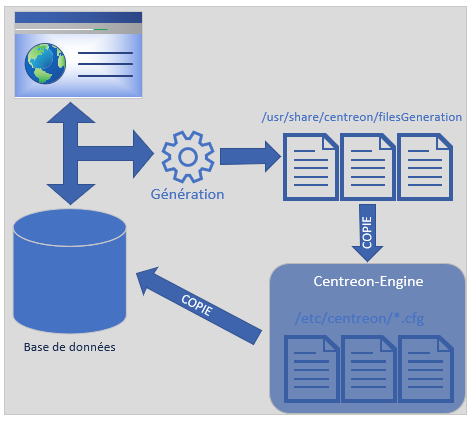

# Generate/Test/Apply Config.

## **⚙️ Configuration dans Centreon : mode brouillon**

Quand on configure des éléments dans l'interface Web (modèles, check-périodes, services...), **rien n’est encore effectif côté supervision**. Ce qu’on fait, c’est **éditer une copie** de la configuration stockée en **base de données**, sans impacter les fichiers .cfg utilisés par **Centreon-Engine**.

➡️ Tant qu’on n’a pas généré et appliqué la config, **le moteur continue de tourner avec l’ancienne version**, ce qui permet de faire des modifs sans casser la supervision en cours.

## **🛠️ Génération des fichiers de configuration**

Quand la config est prête, il faut la **générer** : 📍 *Menu* : **Configuration > Pollers > Export Configuration**

📌 On sélectionne le **Poller** (souvent Central ou localhost si y’en a qu’un).

🎛️ On choisit l’action :

- **Test seulement** ✅ pour simuler la génération (mode debug)
- **Génération sans déplacement** 🧪 pour vérifier les fichiers
- **Génération + Déplacement + Reload** 🔁 pour appliquer en production

Les fichiers générés sont d’abord stockés dans : /usr/share/centreon/filesGeneration/

Puis, si tout est OK, ils sont déplacés vers : /etc/centreon/*.cfg

## **🧪 Test de la configuration**

Avant d’appliquer, on peut (et doit) **tester** :

- Pour éviter de recharger un moteur avec des erreurs
- Pour débugger tranquillement sans impacter la supervision  
  💡 En bas de la page, Centreon affiche le résultat du test (succès ou erreurs)

## **🚀 Application des changements (Reload)**

Une fois la génération validée :

✅ On **coche les options** pour déplacer les fichiers et **recharger le moteur Centreon-Engine**

🔄 Reload est souvent suffisant, redémarrage complet si reconfig du moteur de supervision.

🖥️ L’interface Centreon Web affiche un message de confirmation si tout est bon

## **🔁 Fonctionnement résumé du process :**

1.  ✍️ Création/édition de la config via Web
2.  💾 Enregistrement en BDD
3.  🏗️ Génération des fichiers .cfg
4.  🔍 Test (mode debug)
5.  📦 Déplacement des fichiers vers /etc/centreon/
6.  🔄 Reload du moteur pour prise en compte

