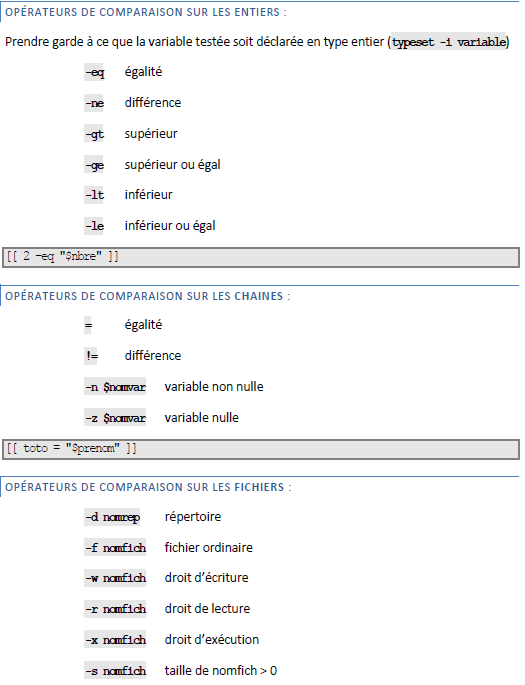

# Les conditions

## **🧪 Commandes de test disponibles**

- `test` ou `[ ]` ➜ test **classique**, compatible tous shells
- `[[ ]]` ➜ **interne à Bash**, **plus riche** (opérateurs logiques, métacaractères)
- `(( ))` ➜ test **arithmétique uniquement** (entiers)

## **🔢 Tests sur les entiers**

Utilisables avec `[[ $var -op valeur ]]` ➜ `typeset -i var` recommandé si modif.
  - `-eq` ➜ égal
  - `-ne` ➜ différent
  - `-gt` ➜ \>
  - `-ge` ➜ \≥
  - `-lt` ➜ \<
  - `-le` ➜ \≤

## **🔤 Tests sur les chaînes**

- `=` ➜ égal
- `!=` ➜ différent
- `-n` ➜ non vide
- `-z` ➜ vide
  
💡 *Ex.* `[[ $prenom = sofia ]]`, `[[ -z $prenom ]]`

## **🗂️ Tests sur le système de fichiers**

- `-d` ➜ répertoire
- `-f` ➜ fichier classique
- `-r` ➜ lecture
- `-w` ➜ écriture
- `-x` ➜ exécution
- `-s` ➜ taille \> 0

## **🧩 Combinaison de conditions**

- `&&` ➜ ET logique
- `||` ➜ OU logique
- `!` ➜ négation
- `( )` ➜ regroupement

💡 *Ex.* : `[[ -f fic1 && ( -d rep1 || -d rep2 ) ]]`

## **🎭 Caractères spéciaux dans les chaînes**

Utilisables dans `[[ "chaine" == motif ]]` 

💡 Bash interprète ces motifs **comme des "glob patterns"**.

- `*` ➜ 0 à n caractères
- `?` ➜ 1 caractère
- `[abc]` ➜ un caractère parmi
- `[^abc]` ➜ un caractère autre que

## **🚀 Facteurs d’occurrence (avec extglob)**

Active avec `shopt -s extglob`. 

Permet des motifs étendus :

- `?(motif)` ➜ 0 ou 1 fois
- `*(motif)` ➜ 0 à n fois
- `+(motif)` ➜ 1 à n fois
- `@(motif)` ➜ exactement 1 fois
- `!(motif)` ➜ tout sauf ce motif

