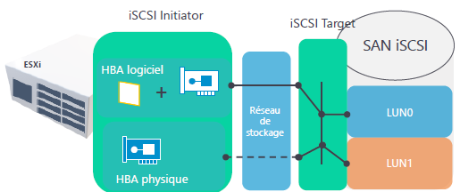

# Adaptateurs de stockage

## 🔗 **Rôle des adaptateurs de stockage**

Les adaptateurs de stockage permettent de relier l’environnement vSphere aux solutions de stockage.

Ils assurent la traduction entre les requêtes du système de virtualisation et le matériel de stockage, local ou distant.

Deux types d’adaptateurs sont disponibles :

- 🧱 **Adaptateurs physiques**
- 🧊 **Adaptateurs virtuels**

### 🧱 **Adaptateurs physiques**

- Cartes installées dans l’hôte ESXi
- Disposent d’une **interface propre de configuration**
- Permettent la détection des disques distants comme **locaux** par l’hyperviseur
  - HBA FC (Fibre Channel)
  - HBA iSCSI
  - CNA (FCoE)
- 🔧 Recommandés pour **de meilleures perfs** et une **moindre sollicitation CPU**

### 🧊 **Adaptateurs virtuels**

- Gérés **par le système d’exploitation de l’hyperviseur** (ex. ESXi)
- Aucun matériel physique requis
  - **iSCSI Software Initiator**
  - **FCoE virtuel**
- 📉 Impact négatif sur les **performances**, car la traduction des requêtes sollicite les **ressources du CPU**

## 🌐 **Utilisation du protocole iSCSI**

- Protocole basé sur **TCP/IP**, facile à déployer
- 📡 Fonctionne avec les réseaux Ethernet standards
- 🔁 Idéal pour les environnements virtualisés avec peu de ressources
- Avantages :
  - Moins coûteux que FC
  - Compatible avec les infrastructures réseau existantes
- ⚠️ Recommandations :
  - Dédier un **réseau spécifique** aux flux iSCSI
  - Prévoir des **mécanismes de redondance**

### 🎯 **Configuration réseau pour iSCSI**

- Dédier une **carte réseau** exclusivement au trafic iSCSI
- Associer cette carte à un **vSwitch** spécifique
- 📶 **Activer le Jumbo Frame** :
  - Définir la **valeur MTU à 9000**
  - 🚨 S’assurer que toute l’infrastructure réseau (switchs, cartes, hôtes) supporte cette taille

- 🔌 **Carte réseau** reliée à un vSwitch dédié
- ⚙️ **HBA(Host Bus Adapter) logiciel ou physique**
- 🌐 **iSCSI Initiator** : composant client
- 💽 **iSCSI Target** : composant serveur qui expose les disques
- 🔄 **LUN (Logical Unit Number)** : volume de stockage présenté à l’hôte

## 🧠 **À retenir**

- Les **adaptateurs physiques** sont à **privilégier** pour des performances optimales
- Les **adaptateurs virtuels** sont pratiques mais peuvent **dégrader les performances**
- Le **protocole iSCSI** est une alternative simple, économique et largement utilisée
- La **qualité du réseau** iSCSI est **critique** pour la fiabilité de la solution
- Le stockage est accessible via :
  - 📂 Disques locaux connectés
  - 🌐 Disques distants via HBA / CNA / adaptateurs virtuels
  - 🔎 Tous visibles depuis l’interface des adaptateurs de stockage dans vSphere

