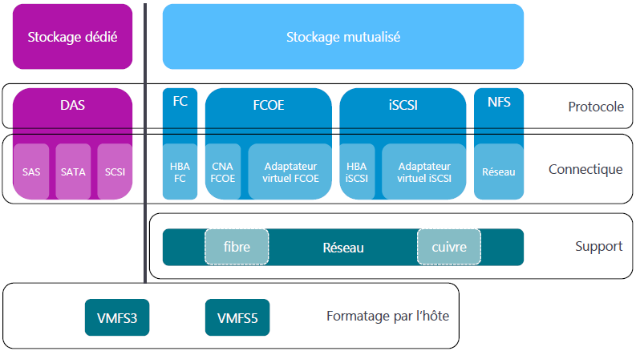

# Intégration vSpherevSphere permet l’utilisation de **plusieurs types de protocoles de stockage**, indépendamment les uns des autres. Ces protocoles sont exploités **au niveau des hyperviseurs** pour accéder à des ressources de stockage locales ou distantes.

📦 **Stockage Direct Attaché (DAS)**

- Chaque hyperviseur peut exploiter un stockage **directement connecté** à lui (DAS).
- ❗ En cas de défaillance de l’hyperviseur, les **VM stockées localement deviennent inaccessibles**.

🧭 **Connectivité de stockage**

- Utilisation d’**adaptateurs de stockage** pour relier un hyperviseur à une solution de stockage.
  - 🧩 **Adaptateur iSCSI** pour relier des **targets iSCSI**
  - 🧩 **HBA FC** (Fibre Channel)
  - 🧩 **Adaptateur virtuel FCoE**
- Ces adaptateurs permettent d’exploiter divers **protocoles d’interconnexion** : FC, FCoE, iSCSI, NFS, SAS, SCSI, SATA

🗃️ **Banques de données (Datastores)**

- Une fois le stockage connecté, on peut créer des **banques de données** (ou **datastores**)
- Rôle :
  - Héberger les **fichiers des VMs**
  - Stocker les **images ISO**
- Ces banques de données sont les **conteneurs virtuels** de l’environnement vSphere

📊 **Considérations pour le stockage**

À prendre en compte pour chaque solution de stockage :

- 🧍‍♂️ **Stockage dédié** à un hôte ou **mutualisé**
- 🔗 **Protocole d’accès** utilisé
- ⚙️ **Support physique** (fibre, cuivre, Ethernet, XDSL...)
- 📑 **Mode d’accès** : bloc de données ou service de fichiers
- 🧾 **Système de fichiers** utilisé (VMFS)

🧩 **Modes d’accès au stockage**

- 🧱 **Bloc de données** → iSCSI, FC, FCoE
- 📁 **Service de fichiers** → NFS
- Le système de fichiers de VMware : **VMFS**
  - 🗂️ VMFS 5 → vSphere 5
  - 🗂️ VMFS 6 → vSphere 6+

