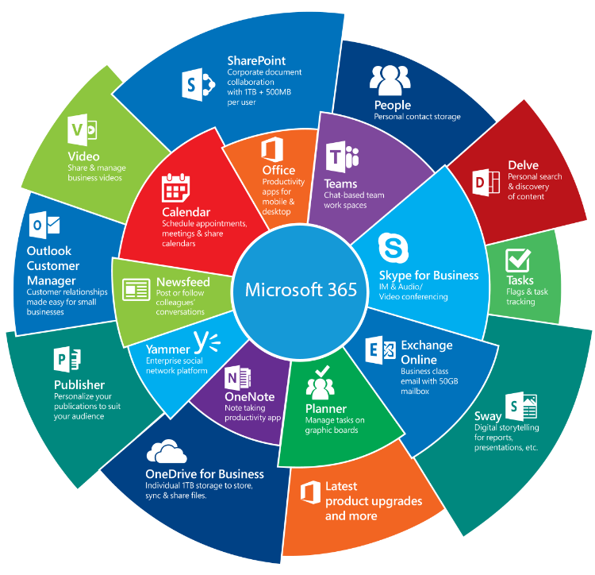

# Licences M365

Tous les services (Exchange Online, OneDrive, Office 365 Pro Plus, Teams, SharePoint…) reposent sur un socle commun : **Azure Active Directory**.

➡️ Sans Azure AD, aucun service Microsoft 365 ne peut fonctionner.

## 🏠 **Licences pour particuliers**

• **Famille**

• **Personnel**

• **Famille Étudiant**

➡️ Destinées à un usage domestique ou scolaire simple.

## 🏢 **Licences pour PME**

• **Business Basique** :

  ◦ Accès web uniquement 🌐

  ◦ Pas d’installation du pack Office

• **Business Standard** :

  ◦ Installation du pack Office possible 💻

  ◦ Accès aux versions desktop des applications

• **Business Premium** :

  ◦ Inclut des services supplémentaires comme la gestion vocale (RDS) 🎧

  ◦ Regroupe certaines fonctionnalités de sécurité (licence P1 sur Azure)

## 🏗️ **Licences pour grandes entreprises**

• **E3** :

  ◦ 100 Go de boîte mail + archivage illimité

  ◦ Accès aux apps desktop et aux services étendus

• **E5** :

  ◦ Ajoute la couche de sécurité avancée + outils d’analyse 🧠

• Autres types :

  ◦ **Apps for Business**

  ◦ **Apps for Enterprise**

➡️ Utiles pour combiner des fonctionnalités spécifiques (attention aux incompatibilités ! ⚠️)

## 🎓 **Licences pour l’éducation**

• **A1** – Services de base (gratuits dans certains cas) 📘

• **A3** – Accès aux applications installables + services supplémentaires

• **A5** – Sécurité avancée + outils de gestion renforcés 🔐

➡️ Plus le niveau est élevé, plus les fonctionnalités sont étendues.

## 🏛️ **Licences pour les associations et organismes publics**

• Système similaire aux PME avec gammes **E1, E3, E5** :

  ◦ **E1** : Services en ligne de base

  ◦ **E3** : Installation des apps + boîte mail 100 Go ✉️

  ◦ **E5** : Sécurité avancée + fonctionnalités de conformité 🔒

## 🧩 **Conclusion – Points clés à retenir**

• Le **choix de la licence** doit dépendre des **besoins concrets** de l’utilisateur ou de la structure 🧭

• Il est essentiel de **maîtriser l’écosystème Microsoft 365** pour fournir un support efficace 👨‍💻

• La **bonne licence** = équilibre entre **fonctionnalités, sécurité, coût** et **simplicité d’usage**. 💡

