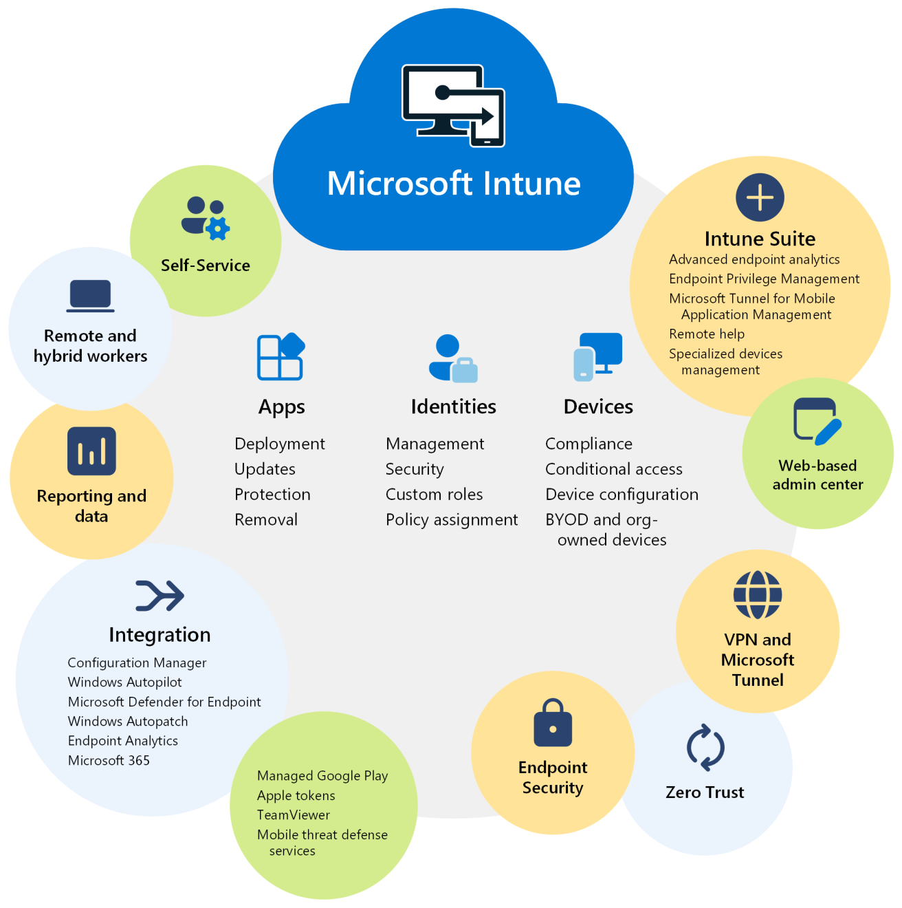

# Intune

## **⚙️ Fonctionnalités principales**

- 🧑‍💼 Gestion des **identités**
- 💻 Gestion des **appareils**
- 🚀 **Automatisation** du déploiement de stratégie
- 🧩 Gestion des **applications**

## **📲 GPM (MDM – Mobile Device Management)**

- Gestion des données d’entreprise sur les appareils
- ✅ Inscription automatique configurée pour :
  - Appareils **Microsoft Entra**
  - Scénarios **BYOD (Bring Your Own Device)**

## **🛡️ WIP – Windows Information Protection**

- Création/déploiement de stratégies de **protection des données pro**
- 🎯 Définir :
  - Les **applications protégées**
  - Le **niveau de protection**
  - Les **règles d’accès aux données** via le réseau

## **🛡️ Groupes de sécurité dynamiques (appareils)**

Création via **Microsoft Entra ID**

- Type : *Appareil dynamique*
- Ajouter une **requête dynamique**

⚙️ **Exemple de règle :**

- 🔍 Propriété : deviceOSVersion
- ➕ Opérateur : *Starts With*
- 🔢 Valeur : 10.0.2 (Windows 11)

✅ Étape de validation :

- Ajouter des périphériques
- Vérifier leur **statut**

## **📦 Déploiement d’applications**

- Intune permet de **déployer des applications** directement sur les appareils gérés
- 🛠️ Gestion centralisée et automatisée des installations

## **🔑 Activation d’Intune**

Depuis **Microsoft Entra ID** 

➡️ Menu **Paramètres** → **Mobilité** → Activer **Microsoft Intune**

