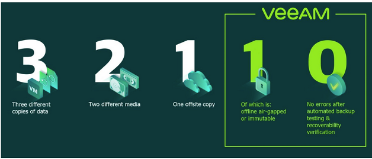

# 3-2-1-1-0**🔐 La règle 3-2-1-1-0 des sauvegardes (stratégie moderne recommandée)**

La sauvegarde des données est **critique** pour garantir la résilience d’un système informatique face à la corruption, aux erreurs humaines, aux pannes matérielles ou aux cyberattaques.

**🧮 Rappel de la règle classique 3-2-1 :**

🔁 **3 copies des données**

💽 **2 types de supports de stockage différents**

☁️ **1 copie hors site**

Cette règle assure une **tolérance aux incidents** grâce à la **redondance**, la **diversité de stockage** et la **résilience géographique**.

**🚀 Mise à jour : la règle 3-2-1-1-0 (stratégie Veeam)**

Cette version améliore considérablement la sécurité face aux **cybermenaces modernes**, comme les ransomwares.

| **🧩 Règle** | **💬 Description** |
|----|----|
| **3** copies | L’original + 2 copies de sauvegarde |
| **2** supports | Exemple : disque dur local + bande, ou NAS + cloud |
| **1** hors site | Pour parer aux sinistres physiques (incendie, vol, inondation) |
| **1** isolée | Une **copie totalement déconnectée** du réseau → 🔌 **Air-gapped** (ex : bande, stockage immuable, cloud Object Lock) |
| **0** erreur | **Aucune erreur lors des tests de restauration** → les sauvegardes doivent être **testées régulièrement** et **fonctionnelles** |

**🔎 Pourquoi c’est important ?**

- ✅ Résistance face aux ransomwares ou à l'effacement malveillant
- ✅ Protection contre la perte de connectivité, la corruption ou un sinistre
- ✅ 🔁 Garantie de restaurabilité à tout moment

**📌 Bonnes pratiques**

- 🧪 **Automatiser les tests** de restauration régulièrement (sandbox, lab, etc.)
- 🔒 **Utiliser des systèmes immuables** (ex : Azure Immutable Blob, Object Lock S3)
- 🧊 **Isoler une sauvegarde** physiquement ou logiquement (bande, coffre cloud, disques offlines)

