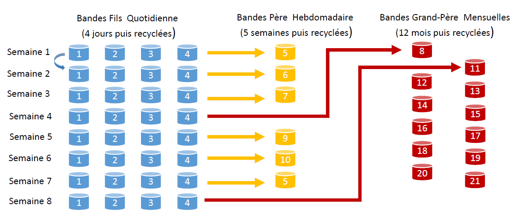

# Rotation des sauvegardesCe module présente le **modèle de rotation GPF (Grand-Père / Père / Fils)** — en anglais **GFS (Grand-Father / Father / Son)** —, la méthode de rotation de médias la plus couramment utilisée dans la planification des sauvegardes.

🔄 **Principe de la rotation GFS**

- **Fils 👶 (quotidien)** :  
  ➤ Utilisé chaque jour de la semaine (ex : du lundi au vendredi) ➤ ♻️ Recyclé tous les **4 jours**

- **Père 👨 (hebdomadaire)** :  
  ➤ Une bande est archivée chaque **fin de semaine** ➤ ♻️ Conservée pendant **5 semaines**

- **Grand-Père 👴 (mensuel)** :  
  ➤ Une bande est archivée chaque **fin de mois** ➤ ♻️ Conservée pendant **12 mois**

📊 **Planification sur 5 jours (standard)**

- Nombre total de bandes nécessaires : **21 bandes/an**
- Chaque semaine suit une rotation de 5 jours
- Exemple de cycle :
  - Semaine 1 : bandes 1️⃣ à 5️⃣ (Fils), bande 6️⃣ (Père)
  - Semaine 2 : bandes 1️⃣ à 5️⃣ réutilisées, bande 7️⃣ (Père), etc.
  - À la semaine 5 : nouvelle bande mensuelle (Grand-Père)
  - À la semaine 6 : bande hebdo 6️⃣ est recyclée
  - À la semaine 7 : nouvelle sauvegarde mensuelle
  - Le processus continue jusqu’à atteindre les **21 bandes**

📅 **Comparatif 5 jours vs 7 jours**

- **5 jours** ➜ 21 bandes
- **7 jours** ➜ 23 bandes  
  ➤ Deux bandes supplémentaires nécessaires pour les jours supplémentaires  
  ➤ Le nombre réel de bandes dépend de la **volumétrie des données** et des **critères de rétention**

🔐 **Rôle de la rotation**

- 📁 **Assure la disponibilité et la sécurité des données**
- 🔄 Permet la **réutilisation optimisée des médias**
- 🛠️ Facilite la **restauration rapide** en cas de besoin

