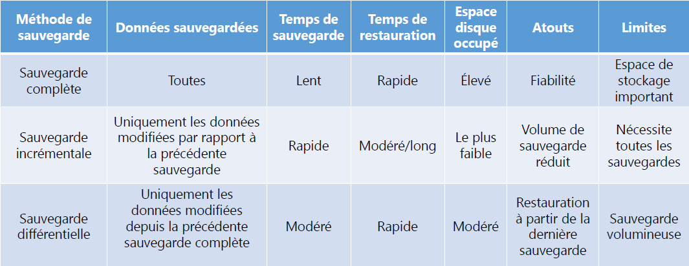

# Types de sauvegarde🗂️ **Méthodes de sauvegarde & attributs de fichiers**

🔸 **Microsoft** – Bit d’archive A

- 🆕 Création d’un fichier : bit_archive = 0
- ✏️ Modification + fermeture : bit_archive = 1
- ✅ Après sauvegarde : bit_archive = 0 (bit réinitialisé)

🔸 **Unix/Linux** – Système de date

- ⏱️ Compare la **date de création/modification** à la **date de la dernière sauvegarde**
- ✅ Méthode plus simple, sans bit d’archivage

🔹 **Autres attributs importants** :

- A : 📝 Fichier modifié (à sauvegarder)
- H : 🙈 Fichier **caché**, non sauvegardé sauf si option activée

🧰 **Types de sauvegarde**

🔁 **Sauvegarde complète**

📦 Copie **l’ensemble** des fichiers et dossiers

➕ Simple et exhaustive

➖ 💾 Fort impact sur le stockage

🔁 Exemple d’usage : initialisation d’une stratégie de sauvegarde

🟨 **Sauvegarde différentielle**

📍 Démarre par une **sauvegarde complète**

➡️ Sauvegarde ensuite **toutes les modifications** depuis la dernière complète

➕ Restauration rapide (1 complète + 1 différentielle)

➖ 🧱 Volume croissant au fil du temps

🟦 **Sauvegarde incrémentale**

📍 Commence aussi par une **sauvegarde complète**

➡️ Chaque sauvegarde suivante ne prend que les **modifications depuis la précédente sauvegarde** (complète ou incrémentale)

➕ Gain de place et rapidité

➖ Restauration plus lente (nécessite toute la chaîne)

