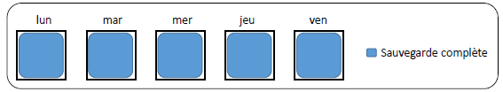

# Complète🗃️💾 **Sauvegarde complète**

La **sauvegarde complète** consiste à copier **l'intégralité des fichiers** présents sur un système à un instant donné, sans se baser sur les attributs de modification. C’est la **base** de toute stratégie de sauvegarde solide.

⚙️ **Fonctionnement**

- 📋 Copie **tous les fichiers**, qu'ils soient modifiés ou non
- ❌ Ne tient **pas compte des attributs** (bit d'archive, date, etc.)
- ✅ **Modifie l’attribut** en fin de sauvegarde pour marquer les fichiers comme sauvegardés
- 🔁 Réalisée à intervalles réguliers (ex : chaque début de semaine)

✅ **Avantages**

🧩 Solution simple et fiable :

- 🔁 **Restauration rapide** : 1 seul fichier à restaurer
- 🛡️ **Fiabilité maximale** : tout est sauvegardé
- 🧹 **Gestion facilitée** : possibilité de supprimer facilement les anciennes sauvegardes

❌ **Inconvénients**

📦 Problèmes liés à l’espace :

- 🏋️‍♂️ **Gourmande en stockage** : chaque sauvegarde double la volumétrie
- 📁 **Redondance** : les fichiers non modifiés sont **re-sauvegardés à chaque fois  **
  → Exemple : un fichier inchangé depuis 1 an est présent dans **toutes** les sauvegardes

