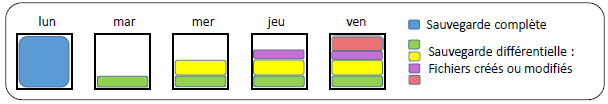

# Différentielle💽📊 **Sauvegarde Différentielle (Cumulative ou T1)**

La **sauvegarde différentielle** consiste à copier **tous les fichiers modifiés ou ajoutés** depuis la **dernière sauvegarde complète**, également appelée **base différentielle**. Cette méthode est dite **cumulative** car **les attributs ne sont pas réinitialisés** après la sauvegarde.

⚙️ **Fonctionnement**

- 📦 Sauvegarde les fichiers avec l’attribut **Archive = 1**
- ❌ **L’attribut n’est pas remis à zéro** après sauvegarde
- 🔁 À chaque sauvegarde, on **re-copie les mêmes fichiers** modifiés depuis la dernière sauvegarde complète
- 📅 Exemple :
  - Lundi → 💾 Sauvegarde complète
  - Mardi → 📁 Sauvegarde des fichiers modifiés depuis lundi
  - Mercredi → 📁 Même chose : modifiés depuis lundi
  - Jeudi/Vendredi → 📁 Toujours depuis lundi = **cumulatif**

✅ **Avantages**

🧩 Méthode intermédiaire entre complète et incrémentale :

- ⚡ **Restauration rapide** (1 sauvegarde complète + 1 différentielle)
- ⏱️ **Temps de sauvegarde modéré**
- 🔐 **Fiabilité** supérieure à l’incrémentielle

❌ **Inconvénients**

📉 Performances à surveiller :

- 🐢 **Plus lente et plus coûteuse** que l’incrémentielle
- 📀 **Pas de rémanence** si un seul support de sauvegarde est utilisé  
  → ⚠️ Perte possible si le média est endommagé

