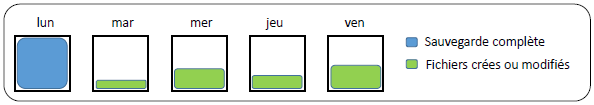

# Incrémentale💽🧮 **Sauvegarde Incrémentale**

La **sauvegarde incrémentale** enregistre uniquement les **données modifiées ou ajoutées** depuis la **dernière sauvegarde**, qu'elle soit **complète** ou **incrémentale**. C’est la méthode la plus économique en espace mais la plus exigeante en cas de restauration.

⚙️ **Fonctionnement**

- 📦 Sauvegarde les fichiers avec **l’attribut Archive = 1**
- ✅ Une fois la sauvegarde faite, **l’attribut est remis à 0**
- 🔁 Chaque jour, seuls **les nouveaux fichiers modifiés** sont sauvegardés

📅 **Exemple de planification** :

- **Lundi** → 💾 Sauvegarde complète
- **Mardi à Vendredi** → 📁 Sauvegarde des fichiers modifiés depuis la veille

✅ **Avantages**

🌱 Optimisée pour la performance :

- 💾 **Faible consommation de stockage**
- ⚡ **Temps de sauvegarde très court**
- 🌐 **Peu de bande passante requise**

❌ **Inconvénients**

🧩 Complexité à la restauration :

- 🐢 **Restauration plus longue** (chaînage de plusieurs sauvegardes)
- 🧷 **Fiabilité réduite** : si un fichier incrémental est corrompu, toute la restauration peut échouer
- 🧠 **Processus complexe** à gérer

