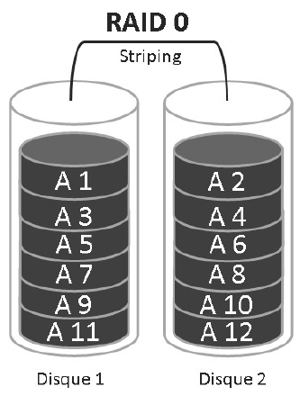

# RAID 0 – Striping

## 🔧 **Caractéristiques**

- ⚙️ Aussi appelé **Striping** ou **Entrelacement**
- 📦 Nécessite **au minimum 2 disques durs**
- 🧱 Les **données sont divisées en blocs**, puis **réparties équitablement** sur tous les disques de la grappe

## 🚀 **Performances**

- 💨 **Excellente vitesse** en lecture/écriture grâce à l’utilisation simultanée des disques
- ⚡️ Optimisé pour les environnements où la **performance est prioritaire**

## ⚠️ **Inconvénients**

- ❌ **Aucune tolérance aux pannes**
- 🛑 Si **un seul disque** devient défaillant → **perte totale** des données
- 🔒 Aucune redondance ni sécurisation des données

## 📌 **Résumé**

Le RAID 0 est une **technologie de performance pure**, adaptée à des cas spécifiques où **la rapidité prime sur la sécurité**. Il est **à éviter** dans les contextes critiques où la **fiabilité des données** est essentielle.

